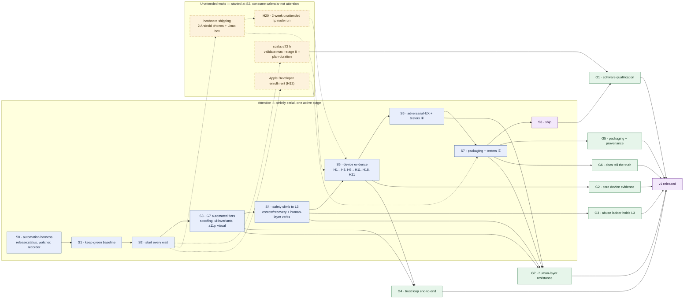

# TwistedPear — v1 release plan

<!-- tp-doc
lifecycle: planned
audited: 2026-07-18
register: release
-->

How we iterate on the app and its testing until it is ready for release, and how we
know when it is. This plan sequences existing machinery; it does not replace the
canonical registers:

- Open software work: [STATUS-SOFTWARE.md](STATUS-SOFTWARE.md)
- Device-/account-gated work: [STATUS-HARDWARE.md](STATUS-HARDWARE.md)
- Verified evidence: [STATUS-COMPLETE.md](STATUS-COMPLETE.md)
- Known costs of the design: [LIMITATIONS.md](LIMITATIONS.md)

Every release gate below traces back to the two claims in
[docs/motivation.md](docs/motivation.md): users know and choose who is involved in
what they do, and running a dangerous program by accident is essentially impossible.

## 1. What v1 ships

| Target                      | Channel                                              | Verification bar                                                 |
| --------------------------- | ---------------------------------------------------- | ---------------------------------------------------------------- |
| Desktop host (macOS, Linux) | Signed installers; macOS notarized                   | Full loop + plan-duration desktop soak + real-LAN evidence (H18) |
| Desktop host (Windows)      | NSIS installer                                       | Ships only if H17 passes; otherwise deferred, not "unverified"   |
| Android host                | Direct APK / F-Droid — no Play Store                 | Device evidence H1–H3, H6–H7, H9–H11                             |
| Web host                    | Self-served from user's node (`tp node --serve-web`) | Web conformance suites + sandbox adversarial review parity       |
| Headless node / seeder      | `tp` CLI                                             | 2-week unattended run (H20)                                      |
| `reticulum-ts` 0.1.0        | Tagged package release                               | After the 72 h transport soak (per STATUS-SOFTWARE)              |

**Not in v1:** iOS beyond dev-build (no store submission; dossier stays current),
Play Store submission, node-to-node propagation peering (use `lxmd`), React
reconciler renderer. **Conditional:** RNode/LoRa support ships as verified only if
H4/H8 hardware evidence lands in time; otherwise it ships labeled _experimental,
simulator-verified only_ in LIMITATIONS §3/§6.

## 2. Release gates

v1 is ready when every gate is green. Gates are evidence statements, not work items —
the work lives in the pipeline (§4).

| ID  | Status  | Gate                                       | Statement                                                                                                                                                                                                                                                                                                                                                                                                                                                                                                              | Evidence source                                                                                    |
| --- | ------- | ------------------------------------------ | ---------------------------------------------------------------------------------------------------------------------------------------------------------------------------------------------------------------------------------------------------------------------------------------------------------------------------------------------------------------------------------------------------------------------------------------------------------------------------------------------------------------------- | -------------------------------------------------------------------------------------------------- |
| G1  | planned | **G1 — Software qualification**            | Every row of the release-qualification table in STATUS-SOFTWARE is complete (plan-duration soaks; `reticulum-ts` 0.1.0 tagged)                                                                                                                                                                                                                                                                                                                                                                                         | `npm run validate:mac -- --stage 8 --plan-duration` logs; release tag                              |
| G2  | planned | **G2 — Core device evidence**              | H1, H2, H3, H6, H7, H9, H10, H11, H18, H20, H21 passed and logged; LIMITATIONS §§3, 5–7 updated with measured values                                                                                                                                                                                                                                                                                                                                                                                                   | STATUS-HARDWARE checklists                                                                         |
| G3  | planned | **G3 — Safety bar: abuse ladder holds L3** | L0–L3 rungs green per [docs/abuse-resistance-loop.md](docs/abuse-resistance-loop.md): escrow/recovery + quorum oracles clean under colluding relays and compromised host; every genuine finding fixed with a committed reproducer                                                                                                                                                                                                                                                                                      | `conformance/sim-campaign/artifacts/report.json`; `conformance/sim-regressions/`                   |
| G4  | planned | **G4 — Trust loop verified end-to-end**    | On real devices, a user can: see an app's source before running, verify author signature, review requested capabilities and reasons, grant/deny, and revoke — and an unsigned/tampered/over-reaching package is refused (hostile-app suites + H9/H11 on device)                                                                                                                                                                                                                                                        | `test:hostile-apps` + H-register logs                                                              |
| G5  | planned | **G5 — Packaging and provenance**          | Versioned, signed artifacts for every shipped target; macOS notarized (needs H12 account); install docs match a from-scratch install on a clean machine                                                                                                                                                                                                                                                                                                                                                                | Release artifacts + walkthrough log                                                                |
| G6  | planned | **G6 — Docs tell the truth**               | LIMITATIONS reflects final measured values; README/Handbook install paths verified; release notes state what is verified vs experimental                                                                                                                                                                                                                                                                                                                                                                               | Doc review against G1–G5 evidence                                                                  |
| G7  | planned | **G7 — Human-layer resistance**            | The trust UI survives adversaries who target the user, not the system: spoofing-resistance fixtures prove a mini-app cannot imitate host chrome or grant dialogs; deception/impersonation abuse verbs sit in the campaign coverage cube with clean oracles; automated UI invariants prove "who is involved" and capability status are reachable from every mini-app screen; a11y scans gate green on trust-critical surfaces; scripted comprehension sessions with outside testers pass their pre-committed thresholds | `test:hostile-apps` + `test:ui-invariants` tiers; campaign report; tester session logs (S3, S6–S7) |

G3 is the deliberate hard choice: L3 requires escrow/recovery product semantics that
do not exist yet (today an explicit scope boundary in the simulation docs). That new
product work sits at the center of the pipeline — see S4. G7 exists because
motivation.md's first claim ("users always know who is involved") is a
_comprehension_ claim, and functional flow tests cannot discharge it; its tester
sessions are the plan's only gate step that requires human perception.

## 3. Operating rules

**Automation rule — automate the crank itself.** Every recurring check must exist as
a checked-in script or test tier (`npm run …`) that a session or CI can execute
without judgment. The pipeline is driven by a release driver built in S0, not by
re-reading documents: `npm run release:status` computes gate status and the single
next action from committed evidence (the status registers, campaign `report.json`,
soak logs, CI results). A step may stay manual only if it requires hardware in hand,
an account action, or human perception — and every such step is wrapped in scripts
that prepare everything before the human moment and verify everything after it.
One-off findings become fixtures; fixtures become tiers; tiers get wired into PR or
nightly CI per [docs/ci-policy.md](docs/ci-policy.md). Any turn that touches a
manual step must try to shrink or script it.

**Serialization rule — one active stage.** Attention is on exactly one stage at a
time: always the lowest-numbered incomplete stage that is not blocked on an
unattended wait. The only permitted overlap is **unattended waits** — soak
wall-clock, hardware shipping, Apple enrollment review, the H20 two-week node run —
which are all started at their designated stage and then consume calendar, not
attention, monitored by the driver. When a wait finishes or fails, it preempts the
active stage: the driver surfaces it, the failure is fixed and the wait restarted,
then the active stage resumes. No other work runs in parallel.

**Green-gate rule — a red gate outranks everything.** A gate that fails on the
tree in front of you preempts every other item, including the release gates and
including starting a soak. This is not a preference about tidiness: the whole
plan is an argument from evidence, and evidence gathered on a tree that fails its
own checks does not support the conclusion. A plan-duration soak makes the cost
concrete — eleven days of wall-clock spent qualifying a revision already known to
be broken, discovered only at the end, restarting from zero.

Two distinctions keep the rule from swallowing the plan:

- **Red is not debt.** The ESLint-family ratchets carry thousands of entries and
  the gates that read them are _green_; that debt shrinks monotonically and is
  ordinary `quality` work. "Red" means a check that fails — `check:ci-base`
  reporting 15/16 on an untouched tree, not a ratchet with entries in it.
- **Red is not waived.** Some gates go red for reasons that cannot be fixed on
  your schedule: a fresh advisory with no upstream release, a dependency
  relicense. `npm run checks:waive` records the gate, the reason, and an expiry
  of at most 30 days. A waived gate is still red everywhere it is reported — it
  simply stops preempting. When the waiver lapses it counts as no waiver at all
  and the soak guard refuses again, so an exemption cannot quietly become
  permanent. The alternative is worse: without a pressure valve, the first
  unfixable-today gate is the day someone comments out the guard.

Enforcement is machinery, not memory:

| Where                 | What it does                                                                                     |
| --------------------- | ------------------------------------------------------------------------------------------------ |
| `npm run work:next`   | `broken-gate` is the first class in the ranking, ahead of `release-gate`                         |
| `work/` derivation    | `GATE-*` items are computed from `checks.json`; they cannot be filed, retyped, or closed by hand |
| `release:start-soaks` | the soak guard refuses a tree with an unwaived red gate, or a stale gate record                  |
| `release:status`      | a red gate replaces the stage ladder's "next action"                                             |
| `npm run work:audit`  | escalates a gate red more than two days, and waivers expiring or already expired                 |

`checks.json` is the committed record of which gates are green, written by
`npm run checks:status`. It carries two fingerprints of what it was measured on:
the application digest (the same one the soak isolation rule uses) and a tree
digest covering everything the gates actually read — `scripts/`, `docs/`, and the
registers included, since an edit there can turn `format` or `unit-tests` red
while leaving the application untouched. The soak guard accepts the record only
when both still match. A green result for other code proves nothing about this
code, so a stale record is refused exactly like a red one.

Each gate also records the tree it was measured on individually. A run on a
machine lacking a toolchain — no Swift, no Rust — skips those gates and carries
their previous result forward, which is what makes partial and matrix runs
workable; but the guard refuses a carried-forward result rather than counting it
as green, because an unmeasured gate is not a passing one. Waiving it is the way
through, and the reason it demands ("no Swift toolchain on the soak host; CI
covers it") is exactly the fact a reader needs.

**Soak isolation rule — a soak qualifies one tree.** A plan-duration soak is
evidence for the exact application code it started against, so two constraints
make that attribution true rather than assumed, both enforced by
`scripts/release/soak-guard.mjs` and not by anyone remembering them:

1. **Release branches only.** `release:start-soaks` refuses to launch unless HEAD
   is on `release/*` with a clean application tree, and it records the branch,
   revision, and application digest into the evidence. Plan-duration soaks
   therefore never run on `main`, where the active stage lands its work.
2. **Any application-code change fails the run.** While Stage 8 is in flight the
   guard re-checks `apps/`, `packages/`, `package.json`, `package-lock.json`, and
   `tsconfig.json` every thirty seconds. A commit, an uncommitted edit, a new
   source file, or a branch switch fails the run immediately: the remaining
   serial soaks would build different code, and the soaks already finished would
   describe code that no longer exists. The failure preempts the active stage
   like any other, and the run restarts from the new revision.

Test, conformance, script, and documentation changes do not trip the guard — S3's
triage tooling and the evidence recorder have to stay editable across an
eleven-day run. What this rule costs is explicit: **application code cannot be
changed on the release branch while its soaks run.** Land it on `main` and pick it
up in the next soak revision, or accept the restart.

## 4. The pipeline

Claude executes every stage; the user does only the steps marked **[user]**
(hardware in hand, purchases, accounts, human perception). Every stage ends by
updating the canonical status registers — this plan is never the record of what
passed.

### S0 — Build the automation harness

The first stage exists so every later stage is cheaper and needs no judgment calls:

1. `npm run release:status` — the release driver: reads the status registers,
   `conformance/sim-campaign/artifacts/report.json`, soak logs, and CI state;
   prints the G1–G7 gate table and the single next action.
2. Soak watcher — tails `validate:mac` stage-8 logs, classifies failures, and emits
   a minimal-reproducer stub for triage instead of requiring log spelunking.
3. Evidence recorder — one command per H-register row and soak that appends the
   pass log to STATUS-COMPLETE and strikes the source row, so register updates are
   generated, not hand-edited.
4. Wire any suite not yet in a PR/nightly tier into CI per
   [docs/ci-policy.md](docs/ci-policy.md).

**Exit:** `release:status` runs green and its "next action" output is correct
against a manual reading of the registers.

### S1 — Keep-green baseline

`npm run build && npm test` plus all CI-tier conformance suites green; any red fixed
before proceeding. **Exit:** one fully green run recorded. Thereafter this is a
standing invariant enforced by CI and checked by the driver at the start of every
session — not a recurring stage.

### S2 — Start every unattended wait

All calendar-bound waits start here, once, then run unattended under the driver's
monitoring:

1. **[user]** Cut the release branch the soaks will qualify —
   `git switch -c release/v1.0.0` from a green `main` — then start the
   plan-duration soaks from it with `npm run release:start-soaks` (Mac powered
   and awake; the 72 h transport soak is the long pole). "Green" is the
   green-gate rule, and it is checked rather than eyeballed: run
   `npm run checks:status` on the branch first, and the guard will refuse to
   launch until every gate is green or waived. The launcher also enforces the
   soak isolation rule; `npm run validate:mac -- --stage 8 --plan-duration`
   bypasses both guards and does not produce G1 evidence.
2. **[user]** Order the hardware in STATUS-HARDWARE's acquisition order — two used
   Android phones first, plus the spare Linux box for H20.
3. **[user]** Enroll in the Apple Developer Program (H12 — longest lead time;
   needed by S7 for notarization).
4. **[user]** As soon as the Linux box exists: start the H20 two-week `tp node`
   run with its `/status` cron.

**Exit:** every wait started and visible in `release:status`. Soak or node-run
failures from here on preempt the active stage per the serialization rule.

Because the soaks hold `release/v1.0.0` frozen, S3–S6 land their application
changes on `main`. The release branch advances only between soak runs: fast-forward
it to the `main` revision you intend to ship, then restart the soaks against that
revision. Every restart costs the full serial duration, so batch the pickups —
this is the schedule cost the soak isolation rule makes visible instead of hiding
in evidence that silently stopped applying.

### S3 — G7 automated tiers

Pure software, no dependencies; builds the automated half of G7:

1. **Spoofing-resistance fixtures** in the hostile-app suite: mini-apps that
   attempt to imitate host chrome, grant dialogs, capability badges, or the
   Handbook. Pass = imitation is impossible by construction (widget whitelist) or
   unmistakably badged as app content. Lands in `test:hostile-apps`, runs per PR.
2. **`test:ui-invariants`** on the existing drivers (Playwright for web/desktop,
   Maestro on the Android emulator): from any mini-app screen, "who is involved" —
   author identity, granted capabilities, capabilities in use, peers being
   contacted — is reachable within two interactions; every grant prompt shows what
   is requested and the author's stated why; revocation is always reachable and
   takes effect without restart.
3. **Accessibility scans** (axe-core against the web/desktop DOM renderer) on
   trust-critical surfaces — a trust UI a screen-reader user cannot operate fails
   motivation.md's "users always know," not just a checklist.
4. **Visual regression** on trust-critical surfaces (grant dialog, source viewer,
   capability badges, revocation flow), so a change that hides trust information
   shows up as a diff in review, not as an opinion.

**Exit:** all four tiers green in CI.

### S4 — Safety climb to L3

Runs exactly as specified in [docs/abuse-resistance-loop.md](docs/abuse-resistance-loop.md):
one fidelity _or_ difficulty increment per turn, six stages per turn, ratchet.
Sequence within this stage:

1. **Hold L2.** Fresh campaign confirming the current rung's exit criteria; fix
   stragglers.
2. **Design escrow/recovery + quorum semantics** — spec/ADR for the authority
   machines the L3 oracles reference, formal twins first (TLA+/Tamarin/ProVerif;
   twin lands before the machine ships).
3. **Implement** the machines behind the sans-IO fence, conformance traces accepted
   from the twins.
4. **Extend the coverage cube with human-layer abuse verbs** (the campaign half of
   G7): deception within granted capabilities, author impersonation and 256t
   look-alikes, trust-bootstrapping ("behave for months, then ship the payload"),
   compromised author keys — each anchored to its STRIDE/LINDDUN mapping, each
   landing with an oracle. Key-compromise cells must exercise revocation
   propagation through the existing containment metrics.
5. **Climb L3** turn by turn: colluding-pair schedules, colluding relays,
   compromised host, calibrated transport distributions. Fix, regression-lock,
   re-baseline until the L3 exit criterion holds.
6. **Lock the rung** into nightly. L4/L5 continue post-release; if RNode
   calibration traces (H4-D) arrive early, fold them in — they do not gate v1.

**Exit:** L3 held; every genuine finding fixed with a committed reproducer.

### S5 — Device evidence

By now the S2 hardware has arrived. Execute the release-gating register rows
serially, in acquisition order: H1 → H2 → H3 → H6 → H7 → H9 → H10 → H11 → H18 →
H21, plus confirming the H20 run (started in S2) completed its two weeks. The
steps are already written as runbooks in STATUS-HARDWARE.

- Claude prepares each row before the session (builds, fixtures, adb scripts),
  triages failures, fixes, and updates LIMITATIONS with measured values via the
  S0 evidence recorder.
- **[user]** executes the device-in-hand steps.
- Non-gating rows (RNode H4/H8, iPhone H13–H16, Windows H17) run here only if the
  hardware is already on hand; otherwise they follow the conditional rules in §1.

**Exit:** all G2 rows logged; LIMITATIONS §§3, 5–7 carry measured values.

### S6 — Adversarial-UX review and tester round ①

1. **Adversarial-UX review**: checklist-driven pass over the trust surfaces —
   look-alike names/ids, urgency framing in app descriptions, capability-request
   social engineering, key-compromise recovery UX. Each finding becomes a fixture
   in the S3 tiers or a campaign cell in S4's cube; the review repeats only when
   trust surfaces change.
2. **[user] Comprehension round ①**: 3–5 testers from outside the project against
   scripted tasks with pass thresholds committed beforehand: "find out who is
   involved in what this app just did," "decide whether this app is safe to
   install and say why," "spot the impersonator among these two apps," "revoke
   this app's network access." Claude prepares the script, builds, and scoring
   sheet; failures route to fixes and a re-run, not to a shrug.

**Exit:** review findings fixed or fixture-locked; round ① thresholds met.

### S7 — Packaging and release candidate

1. Reproducible signed builds for every shipped target; macOS notarization
   ([docs/macos-notarization.md](docs/macos-notarization.md)) using the S2
   enrollment.
2. **[user]** Clean-machine install walkthrough per target following only the
   docs; Claude fixes every gap found.
3. **[user] Comprehension round ②** against the release candidate (same protocol
   as round ①).
4. Release notes: verified claims with evidence links; experimental features
   labeled; LIMITATIONS final pass (G6).

**Exit:** G5 and G6 evidence complete; round ② thresholds met.

### S8 — Ship

Tag and publish `reticulum-ts` 0.1.0 (the 72 h transport soak from S2 must be
complete), publish the host artifacts, and land the release commit updating
STATUS-COMPLETE with the final evidence table. Then the post-release steady state
begins: nightly held rungs, L4/L5 climbing, and the deferred iOS/store decisions as
their own future plan.

## 5. Sequencing

Solid arrows are blocking dependencies; dashed arrows are waits — started by a stage,
then consumed by a later one without holding attention.

**Reading it for "what is ready now."** Exactly two kinds of work are ever ready: the
lowest-numbered incomplete stage on the serial chain, and any wait whose predecessor
(S2, or hardware arrival for H20) has fired. `npm run release:status` computes both
from committed evidence and prints the single next action — the diagram explains the
shape, the driver is the authority on position. Nothing downstream of the active
stage is ready, however tempting it looks: S3's tiers cannot start before S1 is green,
and no device row in S5 is actionable until the S2 hardware wait lands.

If a wait finishes while a later stage is active, its evidence is recorded by the
driver and the pipeline continues; if it fails, it preempts, gets fixed and
restarted, and the active stage resumes. Nothing else runs concurrently.

The soak wait is the one that can also fail without anything going wrong with the
software: per the soak isolation rule, an application-code change on the release
branch fails the run. That is a restart, not a defect — triage it by confirming
the change was intended, advancing the release branch, and starting the soaks
again from the new revision.

## 6. Cadence and definition of done

- **Per session:** run `release:status`; advance the active stage by one
  increment; script or shrink any manual step touched (automation rule); registers
  updated before the session ends.
- **Per S4 turn (weekly default):** one deliberate difficulty or fidelity
  increment, never two dials in one turn.
- **Done:** all seven gates green, confirmed by `release:status`, sealed by the S8
  release commit.
