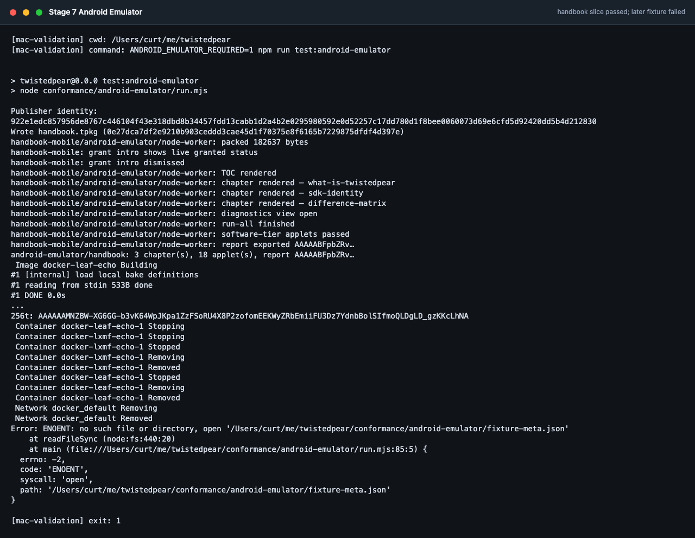

# Android Emulator Lab

<!-- tp-doc
lifecycle: reference
audited: 2026-07-20
register: none
-->

Local procedures for Phase 3/4 distribution and mini-app exits before physical hardware
arrives. CI runs headless proxies (`test:harness-install`, `test:lan-mirror`,
`test:bare-device`); this document covers the UI path on an Android emulator.



2026-07-08 validation capture: the Android emulator handbook slice passed before the lane failed on missing fixture metadata and app launch/build issues.

**Prerequisites:** Android SDK with API 34+ system image, KVM enabled on Linux, docker for
Python peers, repo built (`npm ci && npm run build && npm run build:worklet`).

---

## Setup

```bash
# Start a standard phone AVD (x86_64, API 34 recommended)
emulator -avd Pixel_8_API_34 -no-snapshot-load

# From repo root — install dev client on emulator
cd apps/harness-mobile
npx expo run:android

# Host peer (docker)
docker compose -f conformance/docker/docker-compose.yml up -d --build leaf-echo
```

On the Android emulator, host loopback is `10.0.2.2`. The harness worklet defaults TCP
client to `10.0.2.2:4242` when running on emulator.

---

## E1 — Discover → install over TCP

**Clears:** Phase 3 M7 emulator path; prerequisite for Phase 4 launch.

1. Publish a fixture app on the host:
   ```bash
   npm run demo:phase3
   # or: tp init && tp publish conformance/fixtures/packages/example-app
   ```
2. In harness: create identity → enable **TCP client** → wait for catalog announce.
3. Tap the app → **Install** (default path: Hyperswarm/Hyperdrive when seeder is reachable).
4. Confirm install progress completes and verification badge is green.

**Pass:** package installed, hash matches publisher, mini-app appears in launcher list.

**Headless proxy:** `npm run test:harness-install`

---

## E2 — Forced Resource-path install

**Clears:** BLE/RNode budget path without radio hardware (pipe-only).

1. Publish as in E1; ensure TCP link to publisher or seeder is online.
2. On app detail screen, use **Install via Resource** (forced `forcePath: "resource"`).
3. Confirm install completes over the Reticulum Resource transfer.

**Pass:** `install-progress` reports `resource` path; verified package hash.

**Headless proxy:** `npm run test:harness-install` (resource leg).

---

## E3 — Background mid-download

**Clears:** Phase 2 M2 foreground-service basic survival (emulator tier).

1. Start a large-enough package install (use `example-app` or a staged medium fixture).
2. Press Home when progress is 10–50%.
3. Confirm foreground-service notification remains visible.
4. Return to app; install completes or resumes without corrupt package.

**Pass:** notification visible during background; install succeeds after foreground.

**Note:** Full 8 h OEM battery-manager soak remains device-gated (H3). Emulator CI tier is
`npm run test:android-emulator:e3` (notification + `NodeForegroundService` after Home).

---

## E4 — OTA v1→v2 + rollback

**Clears:** Phase 3 M8 update path on device worklet.

1. Install v1 via E1 or E2.
2. On host: `tp update <app-dir> --version 1.0.1` and republish.
3. Harness: confirm update available → install v2.
4. Use **Rollback** to v1; confirm active version and launch still work.

**Pass:** v2 installs over v1; rollback restores v1 manifest and launches.

**Headless proxy:** `npm run test:updates`

**CI automation:** `workflow_dispatch` → `.github/workflows/emulator.yml` → `emulator-ui` job
(Maestro E1/E2/E4 + E3 adb). Local: `npm run test:android-emulator` (requires adb device + maestro CLI).

---

## E5 — Hyperdrive on device worklet

**Clears:** Phase 3 M1 Bare Hyperdrive on Android; Phase 4 M0 Bare Worker metrics.

1. Ensure DHT/Hyperswarm path is reachable (host seeder + consumer on `10.0.2.2`).
2. Install via default Hyperswarm path (E1 asserts `hyperdrive` in install progress).
3. Tap **Benchmark Bare worker** in the harness mini-app surface.
4. Confirm results show spawn, kill, and busy-loop timings.

**Pass:** sparse Hyperdrive fetch completes (E1); Bare Worker benchmark reports all three metrics.

**CI automation:** `npm run test:android-emulator:e5` (after E1 in full lab). Record with
`ANDROID_BENCHMARK_RECORD=1`.

| Metric                              | Record in                                           |
| ----------------------------------- | --------------------------------------------------- |
| Hyperdrive install success/fallback | E1 maestro (`hyperdrive` in install progress)       |
| Bare Worker spawn latency           | `conformance/android-emulator/measured-worker.json` |
| Bare Worker kill latency            | same                                                |
| Busy-loop watchdog kill             | same                                                |

---

## Optional CI workflow

The optional [`.github/workflows/emulator.yml`](../.github/workflows/emulator.yml) workflow
runs on `workflow_dispatch`:

| Job              | Command / scope                                                                                      |
| ---------------- | ---------------------------------------------------------------------------------------------------- |
| `headless-proxy` | `test:harness-install`, `test:lan-mirror`, `test:bare-device`, `test:updates`                        |
| `android-native` | `npm run test:android-native`                                                                        |
| `emulator-ui`    | KVM API 34 emulator — Maestro E1–E5 + handbook smoke + E3 adb (`conformance/android-emulator/ci.sh`) |

Local UI lab: `npm run test:android-emulator` (Maestro + docker leaf-echo + host peer).

iOS Handbook UI: `npm run test:ios-sim-handbook-ui` or `conformance/ios-sim/ci-handbook.sh` (macOS; `ios-handbook-ui` job in [emulator.yml](../.github/workflows/emulator.yml)).

---

## Quick reference

| Procedure               | Headless proxy                                                                                                         |
| ----------------------- | ---------------------------------------------------------------------------------------------------------------------- |
| E1 TCP install          | `npm run test:harness-install`                                                                                         |
| E2 Resource install     | `npm run test:harness-install`                                                                                         |
| E3 Background service   | `npm run test:android-emulator:e3` + manual emulator                                                                   |
| E4 OTA/rollback         | `npm run test:updates` + Maestro `.maestro/e4-ota-rollback.yaml`                                                       |
| E5 Hyperdrive + Worker  | `npm run test:android-emulator:e5` + `npm run test:bare-hyperdrive`                                                    |
| Handbook UI smoke       | `.maestro/handbook-smoke.yaml` (via shared `conformance/handbook/handbook-peer.mjs` + `npm run test:android-emulator`) |
| Full emulator UI lab    | `npm run test:android-emulator`                                                                                        |
| Native bridge JVM tests | `npm run test:android-native`                                                                                          |

Record outcomes in [STATUS-HARDWARE.md](../STATUS-HARDWARE.md) phase exit checklists.
