# Architecture

<!-- tp-doc
lifecycle: reference
audited: 2026-08-04
register: none
-->

A map of how TwistedPear is put together: the layers, the package graph, the shapes a host
can take, the paths a mini-app and a message travel, and the machinery that keeps all of it
honest. It is an orientation document, not a status claim — for what is built and verified,
read [STATUS-COMPLETE.md](../STATUS-COMPLETE.md); for what is open, read
[STATUS-SOFTWARE.md](../STATUS-SOFTWARE.md) and [STATUS-HARDWARE.md](../STATUS-HARDWARE.md).
Each section ends by naming the canonical document for its subsystem, and
[docs/README.md](README.md) is the index that arbitrates which document that is.

Diagrams are Mermaid and render inline on GitHub and on the
[published site](https://curtcox.github.io/twistedpear/docs/architecture).

## 1. What the system is

TwistedPear is a local-first peer-to-peer application platform. A **peer** is one running
host: it owns a Reticulum identity, speaks to other peers over whatever media are available,
and runs signed **mini-apps** behind a capability broker. There is no server tier — a
gateway, a seeder, and a propagation node are all just peers with a role turned on.

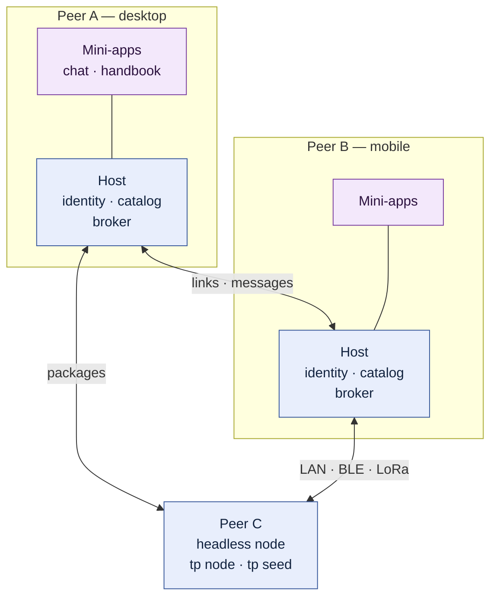

Four constraints shape everything below. Three are not negotiable; the fourth is imposed
from outside and is tracked precisely so that it does not quietly become the third kind:

1. **Wire compatibility.** Reticulum and LXMF behaviour must match the pinned Python
   reference implementations byte for byte. TwistedPear does not author those protocols; it
   maintains a profile and interop evidence against upstream. See
   [specs/README.md](../specs/README.md), Group A.
2. **Sans-IO protocol code.** Protocol modules are pure functions over events; effects are
   returned as data and executed by adapters. See section 4.
3. **Capability-gated apps.** A mini-app reaches the outside world only through broker calls
   that a host-rendered grant screen has authorised. See section 7.
4. **The mobile app lifecycle.** iOS and Android give a platform far less than a desktop OS
   does: almost no background execution, and one active app at a time. Much of what follows
   — backgrounding as an explicit state transition, always-on roles living on desktop peers,
   store-and-forward delivery, foreground-preferring budgets — exists because of it. This
   constraint binds the **host process**, not the mini-apps inside it, and the difference is
   load-bearing: the OS decides whether TwistedPear runs, not how many sandboxes a running
   TwistedPear may hold. [mobile-lifecycle.md](mobile-lifecycle.md) states the constraint and
   keeps an audited ledger of the utility mini-apps lose to it, marking each entry with
   whether the OS actually requires it.

Why the project exists at all is [motivation.md](motivation.md); how it relates to
neighbouring systems is [prior-art.md](prior-art.md); vocabulary is
[glossary.md](glossary.md).

## 2. Layers

The repository is a layered stack. Every layer is usable without the ones above it, which is
what lets a headless conformance runner, a simulator, and a phone all be _the same
implementation_ rather than three that drift.

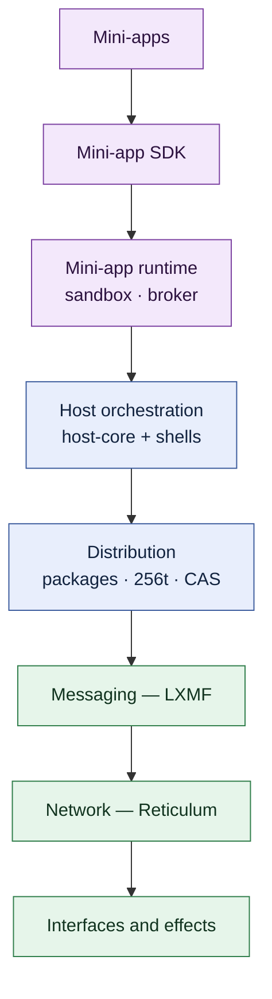

Reading upward: interfaces carry bytes; Reticulum supplies identity, routing, links, and
resources; LXMF supplies messages; distribution turns a signed archive into an installed
app; `host-core` wires those into a host; the runtime sandboxes and brokers mini-apps; the
SDK is what an app author writes against; and the mini-apps — examples, Handbook, DevStudio,
the cookbook — are the product.

## 3. Package graph

Workspaces live under `packages/` (libraries) and `apps/` (host shells and mini-apps).
**Dependency direction flows downward only**: a package may depend on the packages below it
and on nothing else, and packages never depend on apps. The authoritative row-per-package
table — responsibility, permitted dependencies, entry point, focused test — is
[packages/AGENTS.md](../packages/AGENTS.md); this diagram is the shape of it.

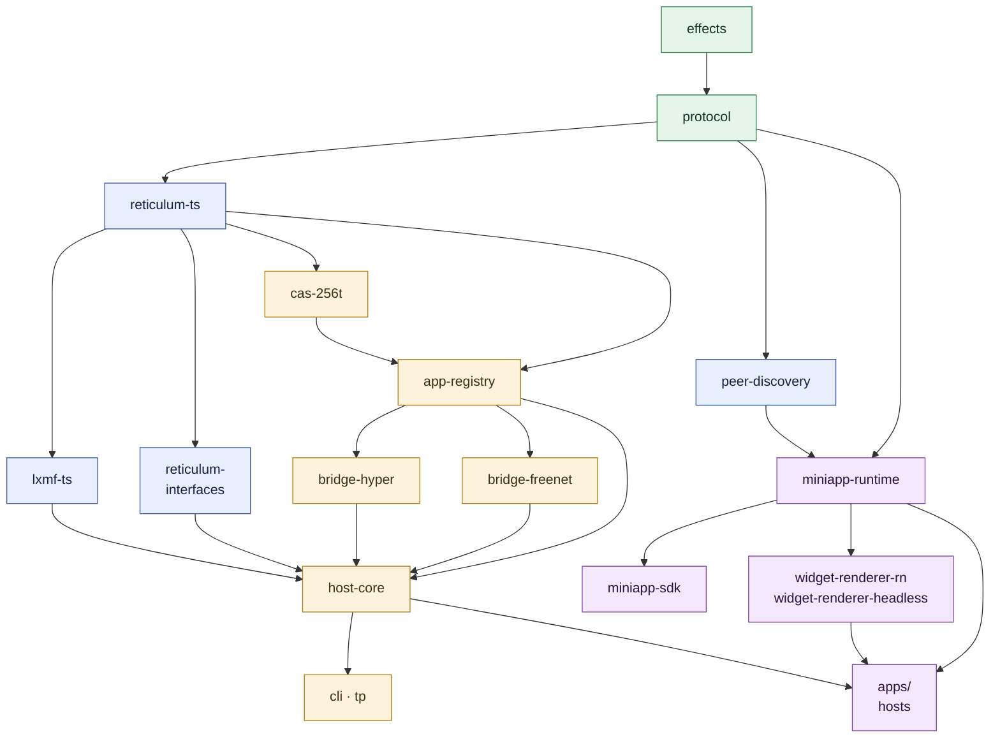

Two packages sit deliberately outside that flow. `worklet-core` has no TwistedPear
dependencies — it is the shared Bare worklet adapter layer (IPC bridges, dev channel) that
desktop and mobile both load. `sim-adversaries` and `sim-campaign` depend on `effects`,
`protocol`, and `miniapp-runtime` and are consumed only by the simulation harness
(section 11).

The graph is enforced, not merely documented: the `structure` gate runs
dependency-cruiser and Knip over it, and cycles, orphans, and layer violations are ratcheted
in `structure-ratchet.json`.

## 4. The Sans-IO boundary

Inside the configured protocol roots — `packages/protocol`, `packages/effects`,
`packages/reticulum-ts`, `packages/lxmf-ts`, `packages/miniapp-runtime`,
`packages/reticulum-interfaces` — code may not read clocks, entropy, or environment,
schedule timers, perform I/O, or log. A protocol module is a function
`step(state, event) → (state', intents)`. Intents are data; an adapter executes them.

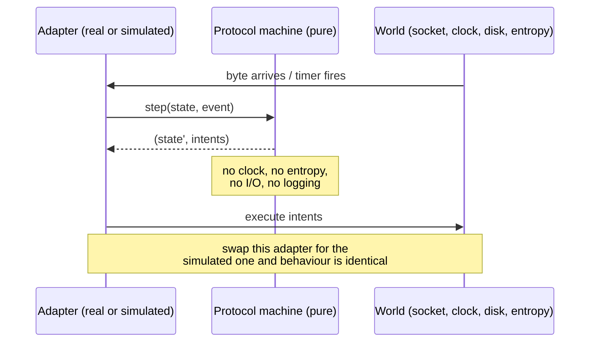

That discipline is what makes the seeded simulator a _conforming host_ rather than a mock:
the same machines run under a virtual clock and a seeded PRNG, so a failing scenario replays
byte-identically. The contract is [SPEC-MACHINE](../specs/spec-machine/spec.md); the
maintenance guide and enforcement machinery are [sansio.md](sansio.md); the boundary itself
is declared in [sansio-ratchet.json](../sansio-ratchet.json) and checked by `npm run sansio`.

## 5. Host topology

A host is `host-core` plus a shell. `host-core` owns identity, the interface manager, the
catalog and fetch plane, LXMF delivery, role wiring, and persistence; the shell supplies a
runtime, a renderer, and a UI. Four shells exist.

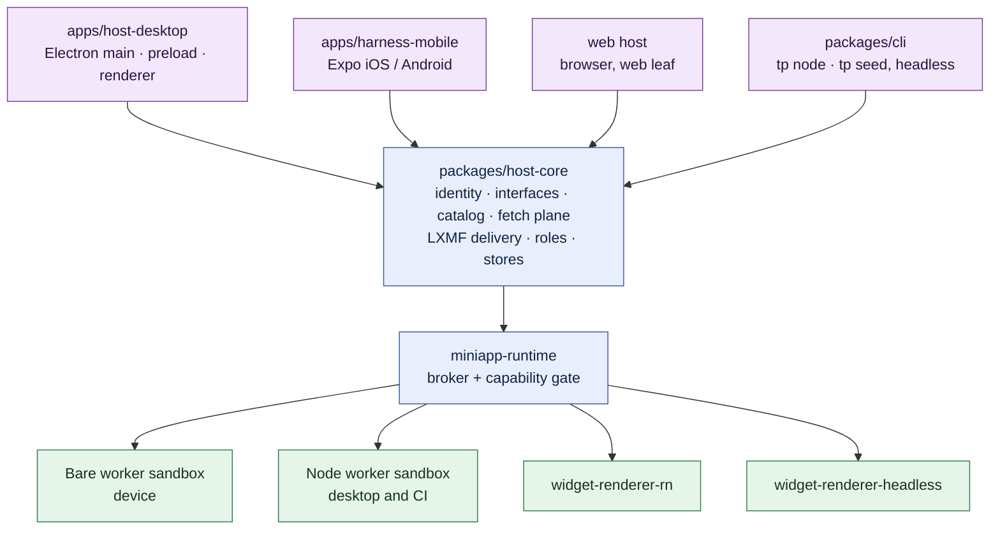

The headless shell is not a lesser host: it is the one CI runs, and the
`widget-renderer-headless` package exists so that UI is a checkable artifact (golden widget
streams) rather than something only a human can confirm. Per-host detail lives in
[desktop-host.md](desktop-host.md), [web-host.md](web-host.md), [ios-host.md](ios-host.md),
and [android-emulator-lab.md](android-emulator-lab.md); which capability works on which host
is [platform-capabilities-status.md](platform-capabilities-status.md); running several peers
on one machine is [local-multipeer.md](local-multipeer.md).

## 6. Distribution: publish, resolve, verify, install

A mini-app is a signed `.tpkg` archive. Its **256t identifier** is a 94-character base64url
string that encodes a 48-bit length plus either the SHA-512 of the content or — for content
of 64 bytes or fewer, such as a publisher's public key — the content itself inline. The
identifier is short enough for a QR code, a chat message, or reading aloud, and it names the
content without carrying it.

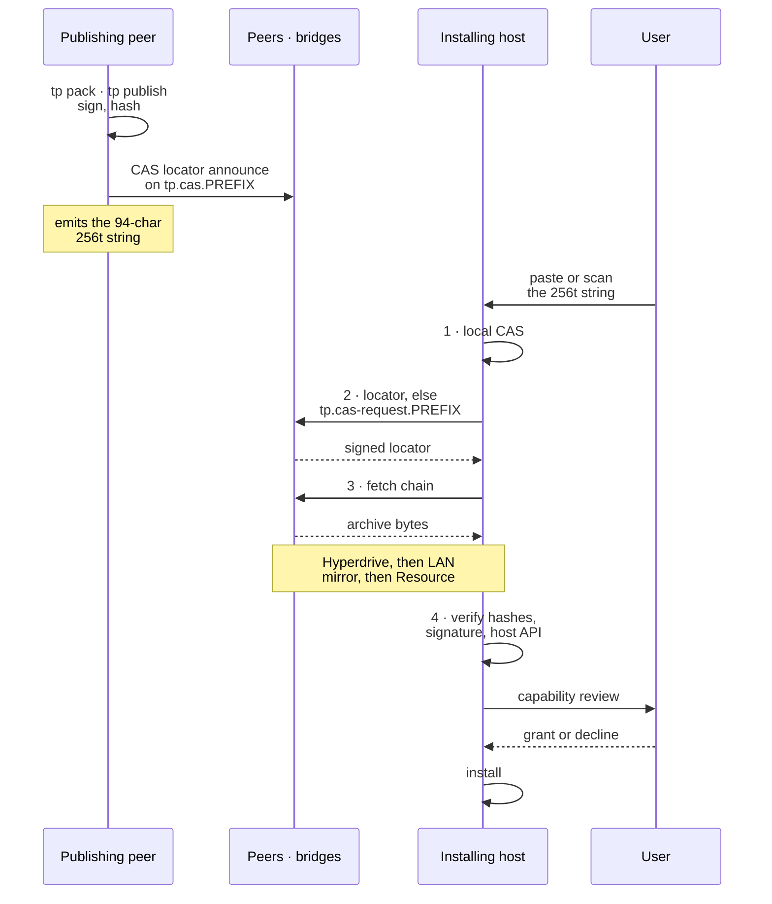

`bridge-hyper` (Hyperswarm/Hyperdrive) and `bridge-freenet` (contract state) are _optional_
adapters on that fetch chain, not requirements: the Reticulum Resource path alone is
sufficient, which is what keeps the platform runnable on a link with no internet behind it.
Canonical documents: [256t-distribution.md](256t-distribution.md),
[package-format.md](package-format.md), [freenet.md](freenet.md), and — for the size limits
that matter on BLE and LoRa — [battery-bandwidth-policy.md](battery-bandwidth-policy.md).

## 7. Mini-app runtime

A mini-app never touches a socket, a file, or the screen directly. It runs in a killable
sandbox, calls a **broker**, and describes its UI as a widget tree that the _host_ renders.
Every broker call that reaches outside the sandbox passes a capability check backed by a
persisted grant lifecycle.

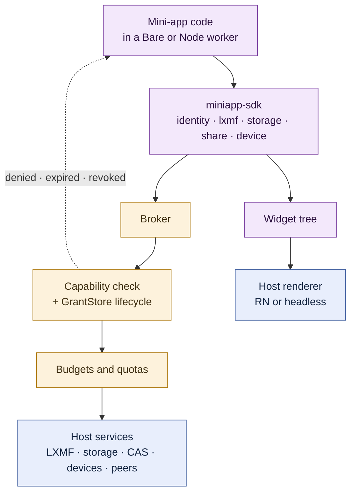

The sandbox choice is deliberate. `BareWorkerSandboxBackend` wins on device and
`NodeWorkerSandboxBackend` on desktop and CI because both can terminate a hostile busy loop
without restarting the worklet; the in-worklet compartment backend cannot, and survives only
as a documented stub. Host-rendered UI means a mini-app cannot draw a fake grant screen over
a real one — the rules for that are [SPEC-CHROME](../specs/spec-chrome/spec.md).

Canonical documents: [miniapp-runtime.md](miniapp-runtime.md), [miniapp-sdk.md](miniapp-sdk.md),
[devstudio.md](devstudio.md), [handbook.md](handbook.md), and the sandbox threat model in
[security-review.md](security-review.md). Device sensors and actuators are
[device-io.md](device-io.md) with [device-class-runbook.md](device-class-runbook.md); peer
media is [realtime-media.md](realtime-media.md).

## 8. Messaging, discovery, and transports

Reticulum supplies identity, addressing, routing, links, and resources. LXMF supplies
messages, propagation, and tickets on top of it. `peer-discovery` finds peers and exchanges
invitations across whichever media a host actually has, and `reticulum-interfaces` is where
each medium becomes a concrete interface.

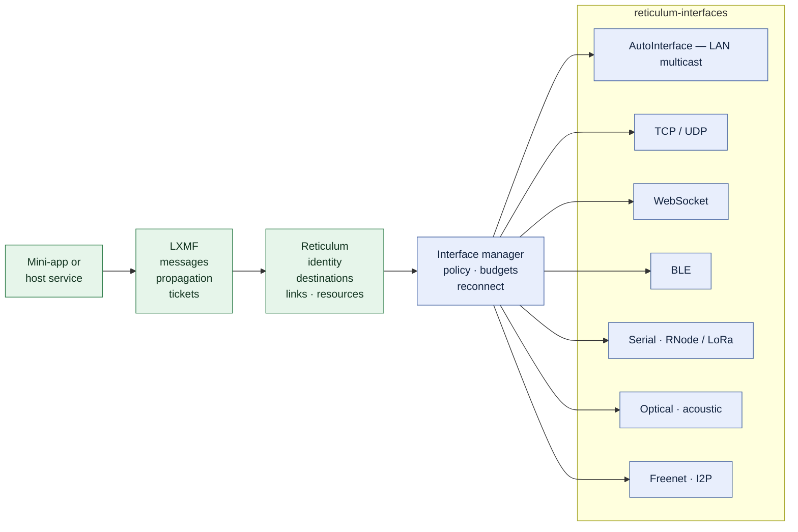

An interface is a policy decision as much as a driver: battery, duty cycle, and link budget
decide whether a 180 KiB package is a reasonable thing to send over BLE. Canonical
documents: [local-peer-discovery.md](local-peer-discovery.md),
[relay-interfaces.md](relay-interfaces.md), [ble-interface.md](ble-interface.md),
[websocket-interface.md](websocket-interface.md), [propagation-node.md](propagation-node.md),
[multipart-propagation.md](multipart-propagation.md),
[battery-bandwidth-policy.md](battery-bandwidth-policy.md), and
[community-network.md](community-network.md). Protocol implementation notes are in the
[reticulum-ts](../packages/reticulum-ts/README.md) and [lxmf-ts](../packages/lxmf-ts/README.md)
package READMEs.

## 9. Specs, conformance, and the four representations

`specs/` decomposes the platform into quasi-independent units — Group A adopted network
specs, Group B execution-substrate specs, Group C platform specs. The governing rule is that
**vectors and formal models are normative and prose is informative**: when a spec's prose
disagrees with its artifacts, the prose is the bug.

The finished template is [SPEC-CAP](../specs/spec-cap/spec.md), where one transition
relation exists in four cross-checked representations:

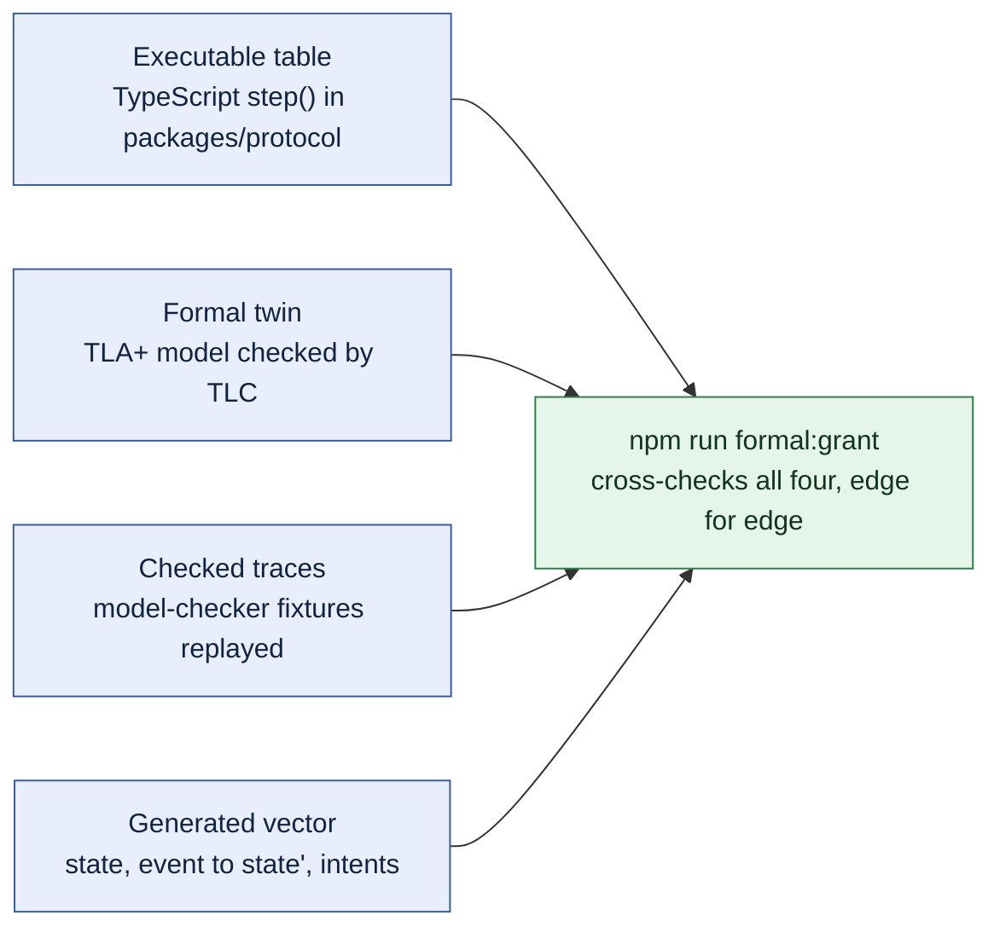

`conformance/` is the layer that runs those artifacts against real implementations, and it is
large on purpose: golden vectors, Docker-backed Python interop, browser slices under
Playwright, simulator and emulator lanes, Bare-runtime and dist-interop bundles, hostile-app
suites, soak runs, and benchmarks. Each area's runners are indexed in
[conformance/README.md](../conformance/README.md) and
[conformance/AGENTS.md](../conformance/AGENTS.md); the spec index is
[specs/README.md](../specs/README.md); formal models are under [formal/](../formal/).

## 10. Quality gates and ratchets

Static analysis is declared exactly once, in
[scripts/checks/registry.mjs](../scripts/checks/registry.mjs). That single registry drives
the local runner, the CI matrix, the site's report pages, and a test that checks the
registry against all three. Adding a gate in one place adds it everywhere.

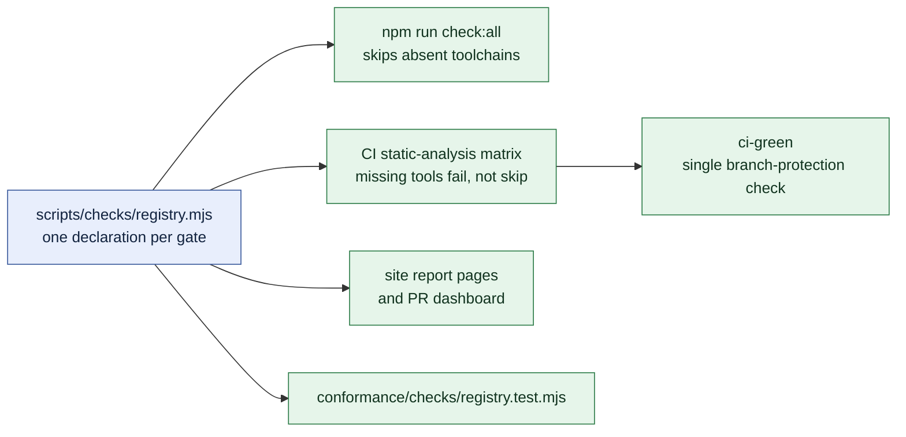

Most gates are **ratchets** rather than pass/fail thresholds: a JSON baseline records the
findings that existed when the gate landed, normal baseline writes may only tighten, and
loosening one requires an explicit `--allow-regressions`. Coverage, structure, complexity,
repository lint, typed lint, formatting, file sizes, licenses, mutation score, and the
Sans-IO boundary all work this way — which is how a large existing codebase gets a strict
gate without a flag-day rewrite. Non-JS languages (Rust, Python, Kotlin, Swift, shell,
Actions) run pinned external tools as their own registry entries.

Canonical documents: [static-analysis.md](static-analysis.md), [ci-policy.md](ci-policy.md),
[file-sizes.md](file-sizes.md), [sansio.md](sansio.md), [security-review.md](security-review.md),
and [mac-validation.md](mac-validation.md) for the full local run.

## 11. Deterministic abuse simulation

Because protocol code is Sans-IO, the whole stack can be run under a virtual clock and a
seeded PRNG with adversaries in the loop. `sim-adversaries` authors adversarial behaviour,
`sim-campaign` runs and replays campaigns, and the capability paths under test are the
_shipping_ ones — a campaign executes through the real `MiniappHost`, its real broker
registration, and the real `GrantStore`, so a weakened capability gate shows up as a failing
negative control.

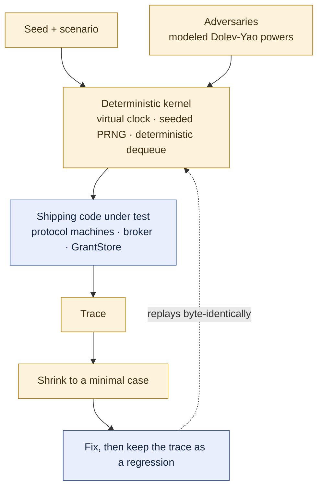

Canonical documents: [simulation.md](simulation.md) for what is verified,
[simulation-plan.md](simulation-plan.md) for what remains,
[abuse-resistance-loop.md](abuse-resistance-loop.md) for the ongoing find-fix loop, and
[simulation-architecture.html](simulation-architecture.html) for the architecture write-up.
The evidence boundary is explicit: physical-layer BLE and LoRa calibration is not claimed
without hardware or independently recorded traces.

## 12. Documentation and site pipeline

Documentation is treated as a build artifact with gates of its own. Every tracked markdown
file carries a `tp-doc` header declaring `lifecycle`, `audited`, and `register`, and current
work and planned work live in **separate files** — `docs/<topic>.md` and
`docs/<topic>-plan.md`, each naming the other. When they disagree, the `live` file wins.

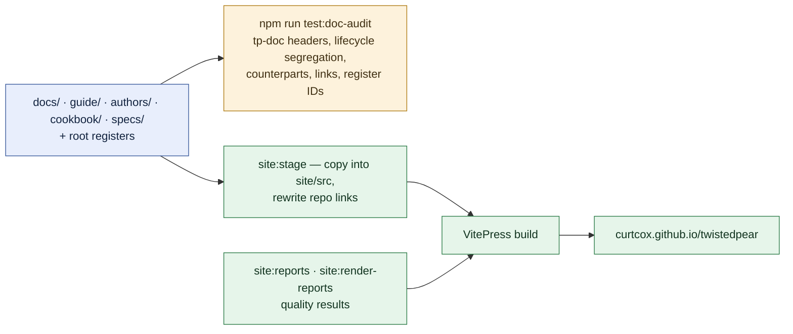

The reader-facing guides are separate deliverables from these developer docs: the
[User Guide](../guide/README.md), the [App Authoring Guide](../authors/README.md), and the
[Cookbook](../cookbook/README.md) each carry a feature-status appendix, and the Handbook
ships the same material _as a mini-app_ so the platform documents itself on a device with no
internet. Superseded plans, closed decisions, and dated evidence move under
[archive/](../archive/README.md) and never describe current behaviour.

## Where the details live

| Subsystem                                       | Canonical document                                                                             |
| ----------------------------------------------- | ---------------------------------------------------------------------------------------------- |
| Repository setup, commands, and repo map        | [README.md](../README.md)                                                                      |
| Mobile lifecycle constraint and its ledger      | [mobile-lifecycle.md](mobile-lifecycle.md)                                                     |
| Documentation index and lifecycle rules         | [docs/README.md](README.md)                                                                    |
| Per-package responsibility and dependency table | [packages/AGENTS.md](../packages/AGENTS.md)                                                    |
| Contributor loop and non-negotiable constraints | [AGENTS.md](../AGENTS.md)                                                                      |
| Specification decomposition                     | [specs/README.md](../specs/README.md)                                                          |
| Conformance suites by area                      | [conformance/README.md](../conformance/README.md)                                              |
| Sans-IO boundary                                | [sansio.md](sansio.md)                                                                         |
| Mini-app runtime and SDK                        | [miniapp-runtime.md](miniapp-runtime.md), [miniapp-sdk.md](miniapp-sdk.md)                     |
| Packages, identifiers, and distribution         | [package-format.md](package-format.md), [256t-distribution.md](256t-distribution.md)           |
| Hosts                                           | [desktop-host.md](desktop-host.md), [web-host.md](web-host.md), [ios-host.md](ios-host.md)     |
| Networking and interfaces                       | [relay-interfaces.md](relay-interfaces.md), [local-peer-discovery.md](local-peer-discovery.md) |
| Capability × host support                       | [platform-capabilities-status.md](platform-capabilities-status.md)                             |
| Quality gates and CI                            | [static-analysis.md](static-analysis.md), [ci-policy.md](ci-policy.md)                         |
| Simulation                                      | [simulation.md](simulation.md)                                                                 |
| Terms                                           | [glossary.md](glossary.md)                                                                     |
| Known limitations                               | [LIMITATIONS.md](../LIMITATIONS.md)                                                            |
| Path to the first release                       | [RELEASE-PLAN.md](../RELEASE-PLAN.md)                                                          |
