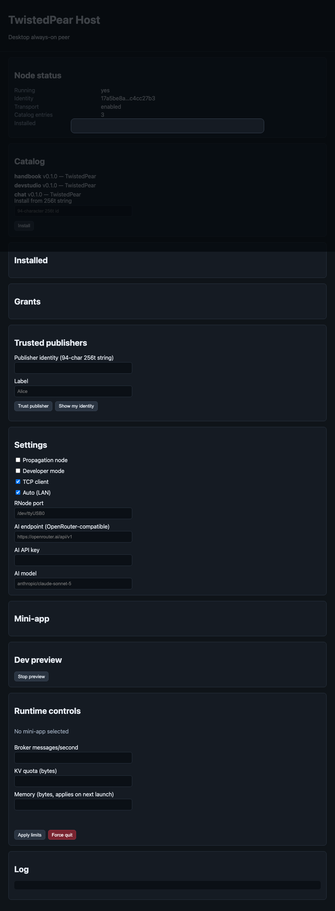

# TwistedPear Desktop Host

<!-- tp-doc
lifecycle: reference
audited: 2026-08-05
register: none
-->

The desktop host is the always-on peer that carries transport routing, package seeding, and optional LXMF propagation for the mobile mesh.

## Architecture

- **Electron shell** (`apps/host-desktop`): tray, power events, native multicast/Bonjour bridges, crash supervision.
- **Bare worklet child**: identical protocol stack to mobile — Reticulum, catalog/install, mini-app runtime.
- **`host-core`** (`packages/host-core`): runtime-neutral node engine shared by Electron and headless `tp node` / `tp seed`.

## Roles (defaults)

| Role                | Default | Notes                                    |
| ------------------- | ------- | ---------------------------------------- |
| Transport node      | on      | Disabled when `--attach-rnsd` is set     |
| Seeder / LAN mirror | on      | Quota'd archive + Hyperdrive serving     |
| Propagation server  | off     | Enable with `--propagation` or UI toggle |
| rnsd attach         | off     | `--attach-rnsd host:port` leaf mode      |

## Headless usage

```bash
tp node --data-dir ~/.local/share/twistedpear/host
tp seed --transport --state-dir .tp/seeder
tp node --attach-rnsd 127.0.0.1:4242 --no-transport
tp node --propagation --status-endpoint
tp node --relay-mode bridge --enable ntfy --ntfy-topic my-topic --ntfy-secret '<shared secret>' --direction rx
# External Freenet node (not bundled): contracts/propagation URL, optional HDLC interface
tp node --freenet --propagation
tp node --freenet-interface --freenet-node ws://127.0.0.1:50509/v1/contract/command
```

Localhost status JSON (opt-in): `http://127.0.0.1:9473/status`

## Security posture

- Renderer: `contextIsolation`, sandbox on, `nodeIntegration` off, strict CSP.
- Widget trees cross the IPC boundary as validated data only (Phase 4 broker chokepoint unchanged).
- Status endpoint binds localhost only.

## Lifecycle

- **Suspend**: Electron sends `suspend-node`; worklet quiesces interfaces (Phase 5 semantics).
- **Resume**: `resume-node` reconnects and re-announces.
- **Crash**: supervisor restarts worklet with exponential backoff.



2026-07-09 capture: renderer shell via Playwright (`conformance/docs/capture-desktop-host-ui.mjs`).
`npm run start --workspace=host-desktop` now clears `ELECTRON_RUN_AS_NODE` (set by
Electron-based IDEs such as Cursor) before launching Electron. The Bare worklet
child clears the linked `node:os` / `node:worker_threads` import graph (2026-07-09)
and reaches an initial `status` message on bare CLI spawn using `PureCryptoProvider`
and a console-log IPC fallback when linked frameworks are absent. When `bare-fs`
addons are unavailable, the worklet falls back to an in-memory KV store (2026-07-09)
so startup no longer crashes on `bare-os`. Full stdio IPC,
identity persistence (`bare-fs`), sodium-native fast path, and Hyperdrive still
require linked addon frameworks (as react-native-bare-kit ships on mobile). Conformance
`test:desktop` exercises the mini-app stack in-process via `node-worker` and
remains green.

## Config

Platform data directory:

- macOS: `~/Library/Application Support/TwistedPear/host`
- Linux: `~/.local/share/twistedpear/host`
- Windows: `%APPDATA%/TwistedPear/host`

Config file: `<data-dir>/config.json` — roles, interfaces, quotas.

The headless host uses the full [Interface Manager](relay-interfaces.md), hot-persists
relay/interface changes, and includes the ten-kind table in `/status`. Electron Settings
hot-controls relay mode and supported interface directions, mirrors mini-app mutations,
shows byte/bitrate state for every kind, and displays persistent app attribution.

## Quotas (conservative defaults)

- Seed storage: 2 GiB
- Propagation store: 256 MiB / 10k messages
- Bandwidth cap: 512 KiB/s per direction (hard, shared by Reticulum, forwarding,
  Hyperdrive replication, and gateway bulk fetches)

See [LIMITATIONS.md](../LIMITATIONS.md) for Windows build-only status (H17) and hardware register rows H18–H20.
