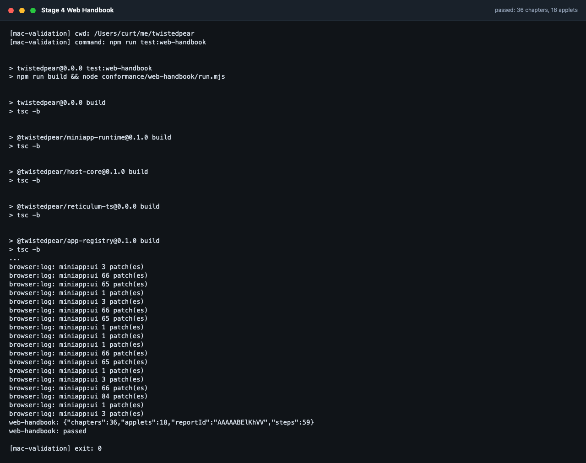
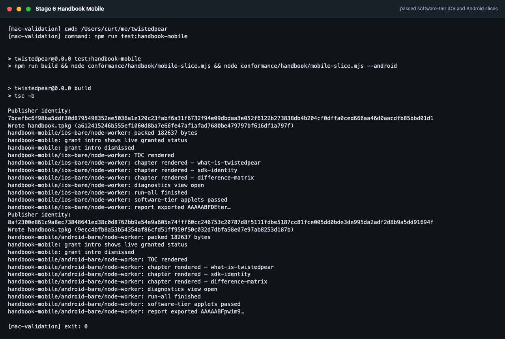

# Handbook: interactive diagnostic documentation for every host (plan)

Status: **done (software tier)** — D0–D4 landed. Tracking:
[STATUS-SOFTWARE.md](../STATUS-SOFTWARE.md); device-gated rows in
[STATUS-HARDWARE.md](../STATUS-HARDWARE.md).

Verify: `npm run build:handbook` · `npm run test:handbook` ·
`npm run test:handbook-report` · `npm run test:web-handbook` ·
`npm run test:handbook-mobile`

The Handbook is the platform's documentation delivered **as a mini-app** — the same
posture as [DevStudio](devstudio.md): a signed, SDK-only bundle running in the standard
sandbox on every host (Android, iOS, desktop, web). It is simultaneously:

- a **reference + tutorial** — what the platform can do and how to do it,
- a **set of interactive tests** — embedded executable applets that demonstrate, on the
  host you are reading it in, that the platform works,
- a **platform-difference explorer** — live per-host capability matrices and exportable,
  comparable diagnostic reports.

Because every applet executes against the real host it runs on, the same content serves
three audiences without forking:

| Audience | What they get |
|---|---|
| Testers | Run applets (individually or "run all") and get pass / fail / unavailable with details; export a structured report and diff it against another device's report |
| Developers | Every applet is a complete, copyable, SDK-only source sample; one tap opens it in DevStudio via the shared workspace / `share:cas` |
| End users | Plain-language chapters plus live "what can *this* device do" pages that explain implementation differences instead of asserting them |

## Why a mini-app (and what that buys us)

1. **Dogfooding is the diagnostic.** If the Handbook installs, renders, and its applets
   pass, the reader has just verified packaging, install, sandbox, broker, widget
   renderer, and every granted SDK surface on their host. The docs *are* the test.
2. **One implementation, four platforms.** The widget protocol is already the
   cross-platform UI seam; no per-host docs UI to maintain.
3. **Distribution for free.** The Handbook is published like any app — announced,
   seeded, installable by 256t id over any transport, updatable via Hyperdrive.
4. **Honest platform differences.** A web host reader sees `BLE: unavailable in this
   host` from a live probe, not from prose that may be stale.

## Architecture

```
apps/handbook/
  content/                 authored chapters (markdown subset) + applet sources
    part-1-concepts/…
    part-3-sdk/lxmf.md
    applets/lxmf-roundtrip/{applet.json, main.js}
  src/                     handbook runtime (TOC, chapter renderer, applet runner,
                           diagnostics aggregator, report export/compare)
  build.mjs                content pipeline: markdown → widget-tree JSON,
                           applets → workspace seed files, coverage gate
  app.manifest.json        capabilities (subset-grantable, see below)
  bundle.js                built output (checked in, like devstudio)
```

- **Content pipeline (build-time, not in-host):** chapters are authored in a markdown
  subset (headings, paragraphs, lists, code fences, intra-handbook links) and compiled
  to widget trees at build time. Long-form text and applet sources ship as **workspace
  seed files** and render content-by-reference (the existing `code-editor` documentId
  pattern), keeping every widget tree under the byte budget.
- **Applet = manifest + single SDK-only source file.** `applet.json` declares: id,
  title, required capabilities, which SDK surfaces it exercises, and an **expectations
  table keyed by platform** (`pass` / `unavailable` / `device-gated`). `main.js` is a
  complete runnable sample — the code shown *is* the code executed.
- **Two execution modes:**
  1. **Inline** — the Handbook runs the applet's exported `run(sdk, report)` in its own
     sandbox with its own grants and renders live results next to the source. Fast, no
     confirmation dialogs, used for diagnostics and most samples.
  2. **Preview slot** — "Run as real app" packages the applet through `apps:preview`,
     demonstrating the full sandbox/grant/launch loop. Subject to the single-preview-slot
     limitation; used sparingly, e.g. the packaging and lifecycle chapters.
- **Diagnostic result model:** every applet run yields
  `{ appletId, status: pass|fail|unavailable|not-granted|skipped, details, timings }`.
  `unavailable` (platform lacks the feature) and `not-granted` (user withheld the
  capability) are first-class outcomes rendered with an explanation — a teaching moment,
  not an error.
- **Reports:** "Run all diagnostics" aggregates results plus host info into a canonical
  JSON report, stored via `share.put` and surfaced as a 256t id / QR. Paste or scan
  another device's report id to render a **cross-platform diff matrix** — comparing
  implementations uses the platform's own sharing primitives.

## Host additions required (small)

- **`host.info()`** (or an extension of `presence.snapshot()`): platform id
  (android/ios/desktop/web/node), host version, `HOST_API_VERSION`, enabled roles,
  available interface types, and quota snapshot. Needed for the live difference matrix
  and report headers. Minor `HOST_API_VERSION` bump per [miniapp-sdk.md](miniapp-sdk.md).
- Nothing else: applets use only existing SDK namespaces and the existing
  double-gated `apps:*` confirmation flow.

## Capabilities the Handbook requests

`identity`, `presence`, `announce:publish`, `announce:subscribe`, `lxmf:send`,
`lxmf:receive`, `storage:kv`, `storage:hyperbee`, `resource:fetch`, `workspace`,
`share:cas`, `apps:preview`, `apps:package` (packaging chapter only).

Like DevStudio, every grant is optional: withholding one turns the corresponding
applets into `not-granted` cards that explain what the capability would allow — the
capability model documents itself.

## Content outline (full-platform scope)

- **Part I — Concepts.** What TwistedPear is; Reticulum fundamentals (identities,
  destinations, announces, links, Resources, LXMF); the Pears bulk plane
  (Hypercore/Hyperdrive/Hyperswarm); control plane vs bulk plane; trust model
  (publisher identity = network identity). Applets: identity + destination hash
  derivation, announce/subscribe loopback, LXMF self-message round-trip.
- **Part II — The hosts.** One chapter per host (Android, iOS, desktop, web, headless
  `tp node`/`tp seed`): architecture, roles, lifecycle, storage locations, gateway
  behavior. Plus the **live difference matrix** (from `host.info()` + probes) and a
  prose companion mapping each difference to its cause (browser sandbox, iOS
  entitlements, OEM BLE, …), cross-linked to [LIMITATIONS.md](../LIMITATIONS.md).
- **Part III — Developing mini-apps.** The tutorial spine. One chapter per SDK
  namespace, each anchored by applets: identity/signing, LXMF messaging,
  announce/subscribe, KV + Hyperbee storage, Resource fetch with budgets, presence,
  widget protocol (an interactive gallery applet per component, including
  `code-editor` and `qr-code`), workspace, `ai.chat`, capability model + typed
  `CapabilityError`, packaging (`tp pack`, deterministic `.tpkg`, 256t ids),
  publish/discover/install/update, DevStudio walkthrough, budgets (BLE 180 KiB) and
  quota rules. Every applet has an "Open in DevStudio" action.
- **Part IV — Diagnostics.** The full suite with run-all, per-area groups (crypto,
  interfaces, storage, distribution, runtime), report export and cross-device
  comparison. Device-gated probes (BLE peer, RNode, multicast/AutoInterface, camera
  QR) render as guided procedures with expected outcomes when hardware is absent.
- **Part V — Reference.** Capability taxonomy, widget schema, package format,
  interface specs ([websocket-interface.md](websocket-interface.md), BLE), quotas,
  host config, CLI. Generated from the same sources the runtime uses
  (e.g. `CAPABILITY_DEFINITIONS`) wherever one exists, so reference pages cannot
  drift from the implementation.

## Phases

### Phase D0 — Skeleton + pipeline (web + node first)
- `apps/handbook` scaffold; content pipeline (markdown subset → widget trees; applet
  bundling; broken-link check); TOC + chapter navigation + reading position in
  `storage:kv`; **one applet end-to-end** (source view → inline run → result card).
- `test:handbook` in `conformance/handbook/`: headless install + render of every
  chapter, execution of every applet on the Node sandbox backend, report schema check.
- Exit: skeleton Handbook installs and runs on web host and node harness in CI.

**Landed (2026-07-08, node harness):** scaffold + pipeline + TOC/chapters + reading
position + 5 software-tier applets; `npm run test:handbook`. Web host CI:
`npm run test:web-handbook` (Playwright install → chapters → applets → report).

### Phase D1 — Applet framework + SDK tour
- Applet runner (inline + preview modes), result model, `not-granted` /
  `unavailable` rendering; the full Part III chapter set with applets covering every
  software-tier SDK namespace; widget gallery.
- **Coverage gate in `build.mjs`:** every SDK namespace and every capability in
  `CAPABILITY_DEFINITIONS` must be exercised by ≥ 1 applet and referenced by ≥ 1
  chapter; CI fails on new surface without docs — this keeps the Handbook honest as
  the platform grows.
- Exit: `test:handbook` green with full applet catalog; budget row added to
  `conformance/budgets` (expect Handbook to exceed the 180 KiB BLE example budget —
  record its own budget; if BLE install matters, split content into per-part packages).

**Landed (2026-07-08, node harness):** 16 chapters, 13 applets covering every
`CAPABILITY_DEFINITIONS` id (identity, presence, announce, lxmf, storage kv/bee,
resource, workspace, ai, apps package/publish/install/preview, share:cas) plus
widget gallery; strict coverage gate (no deferred list); handbook ~71 KiB in
`conformance/budgets` (BLE install of full Handbook not a goal without a split).
Preview-mode chapter still uses inline packaging probes (confirmation-backed).

### Phase D2 — Diagnostics, reports, difference matrix
- `host.info()` host addition (+ `HOST_API_VERSION` minor bump, all four hosts + node).
- Run-all diagnostics; canonical report JSON; export via `share.put` + QR; report
  diff/matrix view; Part II chapters with live matrix.
- `test:handbook-report`: generate reports on web + node hosts in CI, assert the diff
  view detects a seeded expectation difference.
- Exit: two CI hosts produce reports that round-trip through `share:cas` and diff
  correctly.

**Landed (2026-07-08, node harness):** `host.info()` at `HOST_API_VERSION` `0.3.0`
(desktop / mobile / web worklets + node default); Handbook Diagnostics screen
(run-all, `share.put` export + QR, compare/diff matrix); Part II live difference
matrix chapter + `host-info` applet; `npm run test:handbook-report` (node report
round-trip + seeded web-status diff). Web Playwright Handbook CI:
`npm run test:web-handbook` (same software-tier surface in the browser tab).



2026-07-08 validation capture: `test:web-handbook` passed 36 chapters, 18 applets, and report export in Chromium.

### Phase D3 — Mobile hosts + device-gated content
- Run Handbook on Android emulator and iOS simulator harnesses (extend the existing
  `conformance/android-emulator` and `conformance/ios-sim` flows: install → open three
  chapters → run software-tier diagnostics → export report).
- Device-gated applets (BLE pair, RNode, multicast, camera scan) with guided
  procedures; register rows in STATUS-HARDWARE for real-device runs, including a
  cross-device report comparison (phone vs desktop).
- Exit: software-tier suite passes on all four hosts; hardware rows registered, not
  blocking.

**Landed (2026-07-08, mobile harness slices):** four device-gated applets +
`device-gated-probes` chapter; `conformance/handbook/mobile-slice.mjs` (iOS +
Android platform ids, Bare worklet path with node-worker fallback);
`npm run test:handbook-mobile`; wired into `test:ios-sim:required` and
`test:android-emulator` (headless slice before Maestro). Real-device report
comparison rows deferred to STATUS-HARDWARE.



2026-07-08 validation capture: `test:handbook-mobile` passed the software-tier iOS and Android slices.

### Phase D4 — Parts I & V, publish, seed
- Concepts and reference chapters (reference pages generated from runtime sources);
  final editorial pass; "Open in DevStudio" integration.
- Package and sign the Handbook; desktop hosts seed it by default alongside the
  example apps; announce under a well-known publisher identity; document the install
  path in the top-level README (the Handbook becomes the platform's front door).
- Exit: fresh host on any platform can discover, install, and use the Handbook over
  the platform's own distribution system.

**Landed (2026-07-08):** Part I `concepts-in-practice` + Part V reference chapters
(generated from `CAPABILITY_DEFINITIONS`, widget schema, `HOST_API_CHANGELOG`);
**Open in DevStudio** via `share:cas` handoff (`tp.devstudio.workspace.v1`) +
DevStudio import; desktop first-boot bundled catalog (`handbook`, `devstudio`,
`chat`) signed by the deterministic TwistedPear platform publisher
(`conformance/vectors/identity.json` alice); `test:handbook` exercises handoff
round-trip.

**Expanded (2026-07-08):** Part II per-host chapters (Android, iOS, desktop, web,
headless `tp node`/`tp seed`) + Part V interfaces, quotas, CLI, and host-config
reference (generated from `host-core` / runtime defaults). **31 chapters** total;
`test:handbook` renders all.

**Expanded (2026-07-08, editorial):** Part I Pears bulk plane; Part III capability
model, DevStudio walkthrough, and budgets tutorials; Part V host configuration
reference; difference-matrix prose companion. **36 chapters** total.

**Polish (2026-07-08):** Markdown table rendering in chapters; first-run grant
intro screen; diagnostics grouped by area (crypto / interfaces / storage /
distribution / runtime).

**Expanded (2026-07-08):** Preview-slot execution mode (`Run as real app` on
packaging chapter); `host.info().grantedCapabilities` at `HOST_API_VERSION`
`0.4.0` for live grant status on the intro screen; compare matrix grouped by
diagnostic area.

**Conformance (2026-07-08):** `test:handbook` exercises preview-slot launch/stop
and grant-intro granted markers; `test:handbook-mobile` and `test:web-handbook`
assert grant-intro live status.

## Testing strategy

- `test:handbook` (D0–D1): headless chapter render + all applets on Node backend.
- `test:handbook-report` (D2): report generation, share round-trip, diff detection.
- Web (`conformance/web-*` pattern), Android emulator, iOS sim runs (D3).
- `test:handbook-mobile` (D3): iOS + Android platform slices on worklet sandbox path.
- The coverage gate makes documentation part of the definition of done for any new
  SDK surface.

## Risks

1. **Widget protocol expressiveness for long-form docs.** Mitigation: build-time
   compilation to widget trees, content-by-reference for large text, `scroll`/`list`
   composition; extend the whitelist only if a real gap appears (e.g. `markdown` or
   `heading` component — same review bar as any widget addition).
2. **Bundle/package size vs constrained transports.** Mitigation: measure in
   `conformance/budgets` from D1; per-part packages or content-as-Resources if BLE
   install of the full Handbook is a goal.
3. **Grant fatigue.** A first-run screen explains the grant list and the effect of
   withholding each; all applets degrade to explanatory `not-granted` cards.
4. **Docs drift.** The coverage gate + generated reference pages are the mitigation;
   drift becomes a CI failure, not a review comment.
5. **Platform expectation churn.** Expectations tables live beside the applets and are
   validated by the per-host CI runs; a host gaining a feature flips a CI expectation,
   forcing the docs update.
