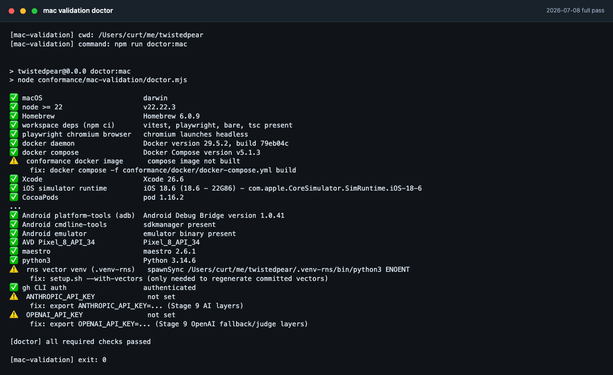
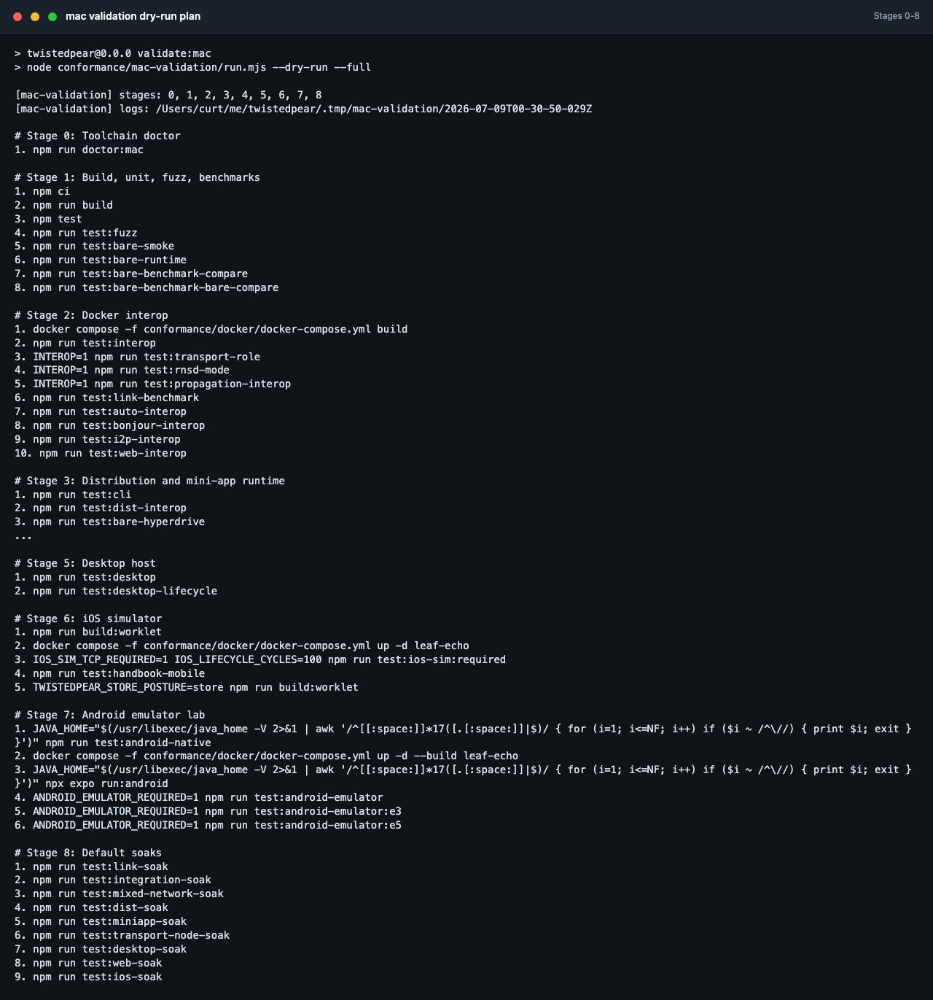
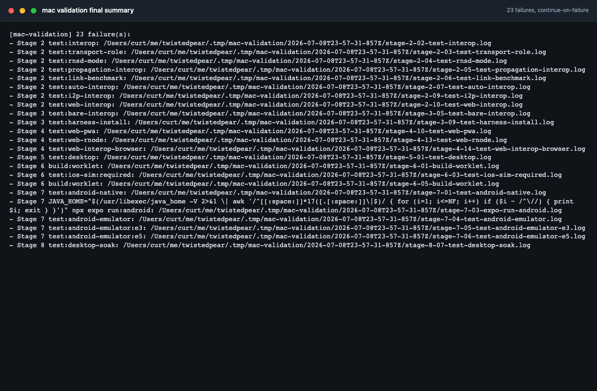
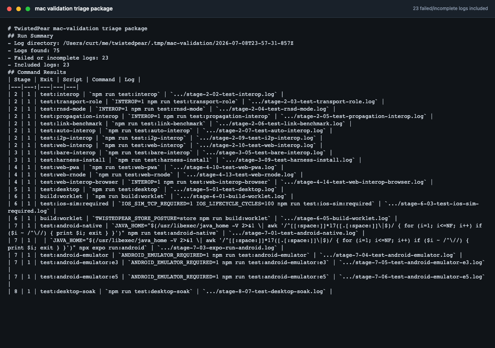

# Single-Mac Automated Validation Plan

How to validate every TwistedPear implementation that can run on one macOS
machine with no additional hardware. Companion to
[STATUS-SOFTWARE.md](../STATUS-SOFTWARE.md) (what remains open) and
[docs/ci-policy.md](ci-policy.md) (how CI covers the same suites). This plan
brings the full CI matrix — Ubuntu + macOS jobs, nightly soaks, and the
`workflow_dispatch` emulator lab — onto a local Mac, plus AI-assisted layers
that CI does not run.

**Out of scope** (tracked in [STATUS-HARDWARE.md](../STATUS-HARDWARE.md)):
real BLE/RNode/LoRa radios, physical phones, real multi-machine LAN, Windows
(H17), macOS notarization (needs a paid Apple account, H12), and OEM
battery-manager soaks (H3).

---

## Stage 0 — Toolchain: install and verify

Three scripts support this plan:

| Script | Purpose |
|---|---|
| `conformance/mac-validation/setup.sh` | Idempotent installer for repo deps, Playwright Chromium, CocoaPods, JDK 17, Android SDK/AVD, Maestro, the conformance Docker image, and optional vector venv. Safe to re-run. |
| `conformance/mac-validation/doctor.mjs` (`npm run doctor:mac`) | Verifies every tool is present, correctly versioned, and functional. Exits non-zero with per-check fix hints on failure. `--ai` additionally makes live (free) key-verification calls to the Anthropic and OpenAI APIs. |
| `conformance/mac-validation/triage.mjs` (`npm run triage:mac`) | Builds a provider-neutral Stage 9 triage package from failed validation logs: command metadata, bounded log tails, the reusable prompt, and matching `STATUS-SOFTWARE.md` row candidates. |

Run order: `bash conformance/mac-validation/setup.sh` then `npm run doctor:mac`.
The doctor is the gate for every later stage — do not start a stage whose
required checks are failing.



2026-07-08 local run: the doctor gate passed all required checks before the full validation pass.

The Stage 1–8 command matrix is implemented by
`conformance/mac-validation/run.mjs`:

```sh
npm run validate:mac                 # doctor + Stages 1–5 (CI-parity local pass)
npm run validate:mac:full            # doctor + Stages 1–8 (mobile + default soaks)
npm run validate:mac -- --dry-run    # print the selected commands
npm run validate:mac -- --stage 7 --start-android-emulator
npm run validate:mac -- --stage 8 --plan-duration  # starts caffeinate automatically
npm run triage:mac                   # package failed logs from the latest run
```



The dry-run plan prints the exact Stage 0–8 commands before the full pass starts.

Each suite is logged under `.tmp/mac-validation/<timestamp>/`. Use
`--continue-on-failure` to gather all failures from a pass, `--ai` to include
live API-key doctor checks, and `--plan-duration` when running Stage 8's
overnight/weekend soak durations instead of the default tier. `--plan-duration`
starts `caffeinate -dimsu` for the selected Stage 8 pass; add
`--no-caffeinate` only if you are managing sleep prevention separately.

Prerequisites that `setup.sh` does not install: Homebrew, Node 22+, Docker
Desktop, Xcode with an iOS runtime, `gh` authentication, and API keys. The
doctor checks these and prints the fix, but they require account or GUI steps.

### Tool inventory

| Tool | Used by | Install mechanism | Verify (what doctor runs) |
|---|---|---|---|
| Node ≥ 22 + npm | everything | already installed (`~/.local/bin/node`) | `node --version` ≥ 22 |
| Workspace deps (vitest, playwright, bare, tsc, esbuild) | all suites | `npm ci` from repo root | `node_modules/.bin/{vitest,playwright,tsc}` and `node_modules/bare/bin/bare` exist |
| Playwright Chromium browser | all `test:web-*` suites | `npx playwright install chromium` | launch Chromium headless and close it |
| Docker + compose | `test:interop`, all `INTEROP=1` lanes, web gateway suites | already installed; keep Docker Desktop running | `docker info` succeeds; `docker compose version` |
| Python peer image | same | `docker compose -f conformance/docker/docker-compose.yml build` | image present (`docker images`) |
| Xcode + iOS simulator runtime | `test:ios-sim*`, `expo run:ios` | already installed (Xcode 26.6) | `xcodebuild -version`; `xcrun simctl list runtimes` shows an iOS runtime |
| CocoaPods | `expo run:ios` native build | `brew install cocoapods` | `pod --version` |
| JDK 17 (Temurin) | Android Gradle builds (`test:android-native`, `expo run:android`) — system JDK 25 is too new for AGP | `brew install --cask temurin@17` | `/usr/libexec/java_home -V` lists an exact 17.x runtime |
| Android SDK (cmdline-tools, platform-tools, emulator, API 34 system image, build-tools) | `test:android-emulator*`, `test:android-native` | `brew install --cask android-commandlinetools`, then `sdkmanager --sdk_root=$ANDROID_HOME ...` (setup.sh does this) | `adb version`; `emulator -list-avds` lists `Pixel_8_API_34` |
| AVD `Pixel_8_API_34` (arm64-v8a on Apple Silicon) | emulator UI lab E1–E5 | `avdmanager create avd` (setup.sh) | listed by `emulator -list-avds` |
| Maestro CLI | Maestro flows in `test:android-emulator` | `curl -fsSL https://get.maestro.mobile.dev \| bash` (installs to `~/.maestro/bin`) | `maestro --version` |
| Python 3 | `vectors:generate` (optional — vectors are committed) | already installed | `python3 --version` |
| `.venv-rns` with `rns==0.9.4` | regenerating identity/token vectors (optional) | `python3 -m venv .venv-rns && .venv-rns/bin/pip install rns==0.9.4` (setup.sh `--with-vectors`) | `.venv-rns/bin/python3 -c "import RNS"` |
| `gh` CLI | dispatching plan-duration soaks to CI as an alternative to local runs | already installed | `gh auth status` |
| Anthropic API access | optional Stage 9 triage/agentic/judge layers | `export ANTHROPIC_API_KEY=...` in shell profile (or provider CLI login) | `GET https://api.anthropic.com/v1/models` with `x-api-key` + `anthropic-version: 2023-06-01` returns 200 (free — no tokens consumed) |
| OpenAI API access | scripted Stage 9 triage, Agents SDK harnesses, and independent judge | `export OPENAI_API_KEY=...` | `GET https://api.openai.com/v1/models` with `Authorization: Bearer` returns 200 (free) |

Disk budget: allow ~30 GB free (Android SDK + system image ~12 GB, Xcode
simulator runtime already present, Docker images ~3 GB, node_modules +
build outputs ~5 GB, soak logs).

---

## Stage 1 — Build, unit, fuzz, benchmarks (no external deps)

Everything here needs only Node and the built workspace.

```sh
npm ci
npm run build            # tsc -b, also the lint gate
npm test                 # full Vitest workspace suite (golden vectors incl.)
npm run test:fuzz        # structure-aware packet/resource/link fuzz
npm run test:bare-smoke  # pure-provider crypto smoke on dist/
npm run test:bare-runtime            # same suite on the Bare runtime
npm run test:bare-benchmark-compare  # Node crypto vs committed baseline
npm run test:bare-benchmark-bare-compare  # Bare sodium-native vs baseline
```

Pass criteria: all green; benchmark compares within their committed
tolerance. Approximate wall time: 10–15 min.

## Stage 2 — Docker interop (Python RNS/LXMF reference)

Requires Docker running and the compose image built.

```sh
docker compose -f conformance/docker/docker-compose.yml build
npm run test:interop                       # incl. resource resume-after-flap
INTEROP=1 npm run test:transport-role
INTEROP=1 npm run test:rnsd-mode
INTEROP=1 npm run test:propagation-interop
npm run test:link-benchmark                # READY-gated handshake latency
npm run test:auto-interop
npm run test:bonjour-interop
npm run test:i2p-interop
npm run test:web-interop                   # W-S1 Node orchestrator lane
```

Pass criteria: all suites green; link-benchmark within baseline. ~20–30 min.

## Stage 3 — Distribution + mini-app runtime conformance (Node)

```sh
npm run test:cli
npm run test:dist-interop
npm run test:bare-hyperdrive
npm run test:bare-hyperswarm
npm run test:bare-interop
npm run test:seeder
npm run test:updates
npm run test:budgets
npm run test:harness-install
npm run test:lan-mirror
npm run test:hostile-apps
npm run test:sdk-interop
npm run test:dev-loop
npm run test:examples
npm run test:handbook
npm run test:handbook-report
npm run test:miniapp-benchmark
npm run test:widget-parity
npm run test:devstudio-loop
npm run test:serialport-load
```

Pass criteria: all green. The `demo:phase3` … `demo:phase6` loops are the
end-to-end smoke variant if a single suite needs a narrative repro. ~30 min.

## Stage 4 — Web host (Playwright/Chromium)

Requires the Chromium browser payload; `web-interop-browser` also needs Docker.

```sh
npm run test:web-runtime
npm run test:web-sandbox
npm run test:web-widget-renderer
npm run test:web-storage
npm run test:web-miniapp
npm run test:web-examples
npm run test:web-distribution
npm run test:web-devstudio
npm run test:web-handbook
npm run test:web-pwa
npm run test:web-hyperdrive
npm run test:web-hyperdrive-browser
npm run test:web-rnode
INTEROP=1 npm run test:web-interop-browser
```

Pass criteria: all green. ~25 min.

## Stage 5 — Desktop host (Electron)

```sh
npm run test:desktop
npm run test:desktop-lifecycle
```

Pass criteria: smoke + lifecycle green (desktop soak is Stage 8). The dmg
packaging job (`electron-pack-macos`) stays in CI; local packaging is not
required for validation. ~10 min.

## Stage 6 — iOS simulator (macOS-only lane)

Requires Xcode, an iOS simulator runtime, CocoaPods, and the `leaf-echo`
docker peer for the TCP/lifecycle slices.

```sh
npm run build:worklet
docker compose -f conformance/docker/docker-compose.yml up -d leaf-echo
IOS_SIM_TCP_REQUIRED=1 IOS_LIFECYCLE_CYCLES=100 npm run test:ios-sim:required
npm run test:handbook-mobile           # D3 handbook slice (iOS + Android worklet paths)
TWISTEDPEAR_STORE_POSTURE=store npm run build:worklet   # store-posture bundle guard
```

Pass criteria: full host loop (catalog → install → grant → launch → update →
rollback), lifecycle reconnect metrics recorded, store-posture build refuses
non-store interfaces. First run pays the `expo run:ios` native build (~15
min); subsequent runs ~20 min.

## Stage 7 — Android emulator lab

This is the largest CI-only surface being brought local. Requires JDK 17,
Android SDK, the `Pixel_8_API_34` AVD, Maestro, and Docker.

```sh
# One-time: native project + dev client on the emulator
export JAVA_HOME="$(/usr/libexec/java_home -V 2>&1 | awk '/^[[:space:]]*17([.[:space:]]|$)/ { for (i=1; i<=NF; i++) if ($i ~ /^\//) { print $i; exit } }')"
npm run test:android-native            # JVM unit tests (BLE, multicast, USB bridges)

emulator -avd Pixel_8_API_34 -no-snapshot-load &
docker compose -f conformance/docker/docker-compose.yml up -d --build leaf-echo
cd apps/harness-mobile && npx expo run:android && cd ../..

# Full UI lab: Maestro E1–E5 + E3 adb foreground-service check
npm run test:android-emulator
npm run test:android-emulator:e3
npm run test:android-emulator:e5       # Bare Worker benchmark on emulator
```

Pass criteria per [docs/android-emulator-lab.md](android-emulator-lab.md):
E1 TCP install with `hyperdrive` path asserted, E2 forced Resource path, E3
foreground service survives Home, E4 OTA v1→v2 + rollback, E5 worker
benchmark records spawn/kill/busy-loop metrics. First run ~45 min (Gradle
build + emulator boot); subsequent runs ~20 min.

Note: on Apple Silicon the emulator uses the arm64-v8a API 34 image and runs
under Hypervisor.framework — no KVM needed (KVM is the Linux-CI detail).

## Stage 8 — Soaks (tiered)

Default tier runs every soak at its CI duration inside the standard
validation pass:

```sh
npm run test:link-soak
npm run test:integration-soak
npm run test:mixed-network-soak
npm run test:dist-soak
npm run test:miniapp-soak
npm run test:transport-node-soak
npm run test:desktop-soak
npm run test:web-soak
npm run test:ios-soak            # add :required when the sim lane must gate
```

Each defaults to ~5 min (`SOAK_DURATION_MS=300000` equivalents). ~1 h total.

**Plan-duration tier (opt-in).** These close the remaining
[STATUS-SOFTWARE.md](../STATUS-SOFTWARE.md) exits and occupy the Mac for long
stretches — run overnight/weekend, one at a time, with sleep disabled:

```sh
npm run validate:mac -- --stage 8 --plan-duration
```

The runner keeps the Mac awake with `caffeinate -dimsu` while the plan-duration
stage is active. To run the same commands manually:

```sh
caffeinate -dimsu &        # if not using the runner

# Night 1 (1 h + 24 h can overlap only if RSS monitoring stays readable — prefer serial)
LINK_SOAK_DURATION_MS=3600000        npm run test:link-soak
SOAK_DURATION_MS=86400000            npm run test:integration-soak

# Night 2–3
SOAK_DURATION_MS=86400000            npm run test:dist-soak
SOAK_DURATION_MS=86400000            npm run test:mixed-network-soak

# Night 4
SOAK_DURATION_MS=86400000            npm run test:miniapp-soak
SOAK_DURATION_MS=86400000 IOS_LIFECYCLE_CYCLES=100 npm run test:ios-soak:required

# Weekend (72 h each — these are the Phase 1 M8 / Phase 6 M7 exits)
TRANSPORT_SOAK_DURATION_MS=259200000 npm run test:transport-node-soak
SOAK_DURATION_MS=300000 DESKTOP_SOAK_CYCLES=864 npm run test:desktop-soak
```

Exit criteria (per phase plans): flat RSS, zero crashes, zero worklet
restarts, roles intact after churn. Capture RSS with the suite's built-in
metrics; the Stage 9 triage layer summarizes the logs. Alternative: dispatch
the same durations to CI with
`gh workflow run nightly.yml -f soak_duration_ms=86400000 ...`
(see [ci-policy.md](ci-policy.md)) if the Mac is needed for other work.

After the 72 h transport-node soak passes, tag `reticulum-ts` 0.1.0
(Phase 1 M8) and update LIMITATIONS §1.

## Stage 9 — AI-assisted validation layers

These use whichever AI accounts are available. Verify configured keys with
`npm run doctor:mac -- --ai` before starting. Prefer two independent model
families when judging ambiguous evidence. Do not gate this plan on a hardcoded
model slug: use the best available coding/reasoning model in the provider
account and record the exact model used in the validation notes.

If Anthropic tools are unavailable, degraded, or blocked by account policy,
use OpenAI tooling for the same layer:

| Layer | Primary path | OpenAI fallback |
|---|---|---|
| Failure triage | Claude Code or Anthropic API over captured logs | Codex in this repo, or a small script against the OpenAI Responses API |
| Exploratory browser testing | Claude browser tooling or Playwright | Codex app/browser tooling, Codex CLI with Playwright, or an OpenAI Agents SDK harness that drives Playwright |
| Exploratory desktop testing | Claude computer-use tooling | Codex app computer/browser tooling if available; otherwise run manual Electron exploration and use OpenAI only for log/screenshot analysis |
| Ambiguous verdicts | Anthropic + OpenAI agreement | Two materially different OpenAI models/prompts, followed by human review on disagreement |

OpenAI API keys and Codex access are separate auth paths. `doctor:mac -- --ai`
only verifies the API-key path for scripted calls. If using Codex app/CLI as
the fallback, first verify the tool is signed in and can see this repository.

### 9a. Failure triage & reporting

Wrap any stage in a log-capturing runner (`script -q <log> npm run <suite>`
or `... 2>&1 | tee`). On failure, feed the tail of the log plus the suite
name and the relevant STATUS-SOFTWARE row to the AI tool and ask for:
(1) failure classification — product bug / flaky test / environment /
toolchain, (2) the most likely responsible file(s), (3) a drafted
STATUS-SOFTWARE.md row update. Batch all failures from a pass into one
request so clustering works across suites.

Simplest harness: point Codex or Claude Code at the log directory with the
brief "triage these suite logs", or generate a ready-to-paste package with
`npm run triage:mac -- --log-dir .tmp/mac-validation/<timestamp>`. Scripted
alternatives are small Node scripts using the Anthropic SDK or OpenAI
Responses API. Keep the prompt provider neutral so the same evidence package
can be sent to either model:

```text
You are triaging TwistedPear mac-validation failures. Use only the attached
logs and repository context. For each failed suite, classify the failure as
product bug, flaky test, environment, or toolchain; identify likely files;
propose the next verification command; draft any STATUS-SOFTWARE.md update.
Do not mark a plan-duration soak complete unless the requested duration ran.
```

### 9b. Agentic exploratory UI testing

Beyond the scripted Maestro/Playwright flows, run periodic exploratory
sessions:

- **Web host + Handbook:** start `tp node --serve-web` (after
  `npm run build:web-host`), then drive Chromium via Claude Code, Codex
  browser tooling, or a Playwright harness with an open-ended brief:
  install an app from a 256t, exercise every Handbook applet, try to break
  grants/install review. Artifacts: screenshots + a written findings list.
- **Desktop host:** launch `npm run start --workspace=host-desktop` and use
  available desktop-control tooling for the same brief on the Electron
  surface. If no reliable desktop-control tool is available, do the clicks
  manually and feed the logs/screenshots to Claude or OpenAI for analysis.

These sessions are exploratory, not gating — file findings as issues or
STATUS rows; promote reproducible ones into scripted conformance tests.

### 9c. Cross-model judge

For ambiguous, judgment-shaped results — Handbook report diffs
(`test:handbook-report` compare matrix), benchmark regressions near
tolerance, soak RSS curves that are "mostly flat" — send the same evidence
to both Anthropic and OpenAI with the same rubric and compare verdicts.
Agreement → accept; disagreement → human review. If Anthropic is unavailable,
send the evidence to two different OpenAI models or two independent OpenAI
prompt passes and require human review for any split decision. This is cheap
insurance against a single model rationalizing a regression away.

Key hygiene: keys live in the shell profile or keychain, never in the repo;
the doctor only reports presence and models-endpoint reachability, never the
key value.

---

## Standard full pass (recommended cadence)

1. `npm run doctor:mac` — gate.
2. Stages 1–5 serially (~1.5–2 h). These match the CI PR matrix.
3. Stage 6 (iOS sim) and Stage 7 (Android lab) — the two lanes CI runs only
   partially or on dispatch; this is where a local pass adds the most value.
4. Stage 8 default tier (~1 h).
5. Stage 9a triage over any failures; 9b/9c on a weekly cadence or before a
   release tag.



2026-07-08 full pass with `--continue-on-failure`: the runner completed Stages 0–8 and reported 23 failures.



The triage package includes the failed logs and command metadata for follow-up classification.

### 2026-07-08 full-pass failure clusters

The pass completed Stages 0–8 with `--continue-on-failure` and reported **23 suite failures**. Triage evidence lives in `.tmp/mac-validation/2026-07-08T23-57-31-857Z/triage-package.md`. High-level classification:

| Cluster | Suites | Class | Next verification |
|---|---|---|---|
| Docker peer path timeouts | `test:interop`, `test:transport-role`, `test:rnsd-mode`, `test:link-benchmark`, `test:web-interop`, `test:bare-interop` | environment | Confirm compose peers are up and reachable on localhost ports |
| Worklet Bare-pack (`ws` → `stream`/`zlib`) | `build:worklet`, `test:desktop`, `test:ios-sim:required`, `test:harness-install` | product bug | Re-run `npm run build:worklet` after Bare shim / dependency graph fix |
| Android emulator lane | `test:android-native`, `expo run:android`, `test:android-emulator*` | mixed | Fix minSdk 28, generate `fixture-meta.json`, rebuild dev client |
| Web gaps | `test:web-pwa`, `test:web-interop-browser`, `test:web-rnode` | product / flaky | Re-run individual Stage 4 suites after bundle/IDB fixes |
| Isolated exports / missing entrypoints | `test:propagation-interop`, `test:desktop-soak` | product bug | Fix missing `msgpackUnpackPropagationEnvelope` export; add desktop soak loop |

**2026-07-09 partial re-verification:** the worklet Bare-pack cluster
(`build:worklet`, `test:desktop`, `test:ios-sim:required`, `test:harness-install`)
and `test:desktop-soak` now pass locally. `test:propagation-interop` still
fails after the export fix (in-process sync: *Propagation node identity is
unknown*). Electron `npm run start --workspace=host-desktop` launches when
`ELECTRON_RUN_AS_NODE` is unset (the start script does this automatically); the
desktop GUI screenshot is in [desktop-host.md](desktop-host.md). The Bare
worklet child still crashes on linked `node:os` imports — see
[mac-validation-screenshots-plan.md](mac-validation-screenshots-plan.md#phase-4--post-fix-re-verification-2026-07-09).

See [mac-validation-screenshots-plan.md](mac-validation-screenshots-plan.md) for the per-suite table and screenshot capture notes.

Plan-duration soaks (Stage 8 opt-in) are scheduled separately and are the
only remaining software-tier exits in STATUS-SOFTWARE once the standard pass
is green.
